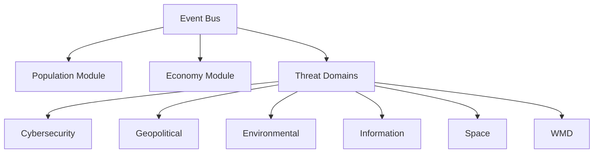
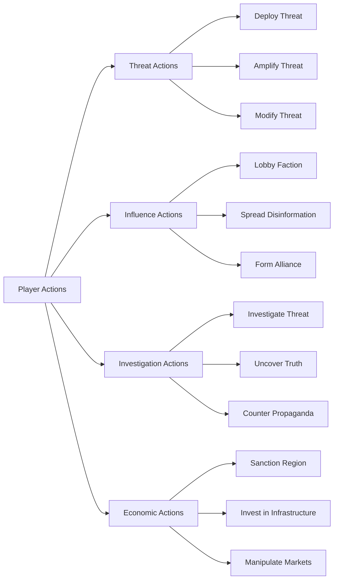
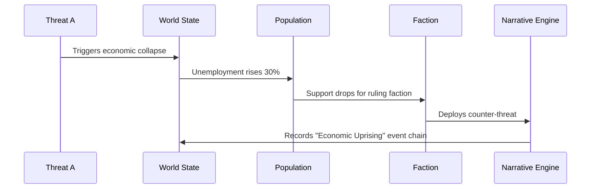
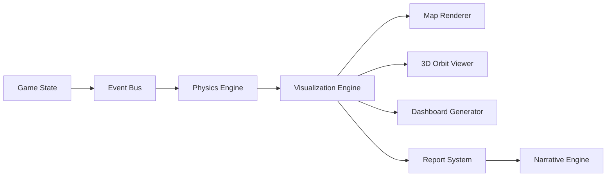
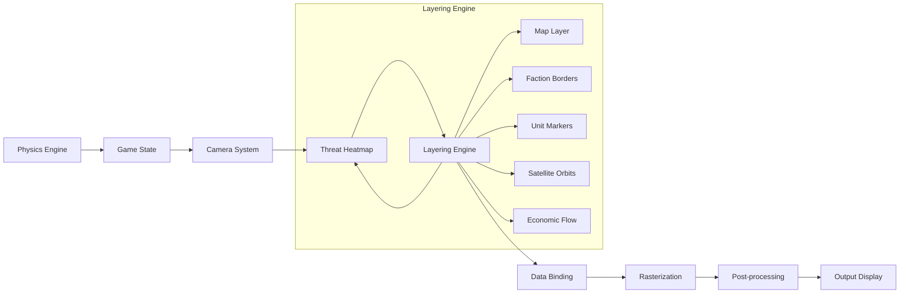
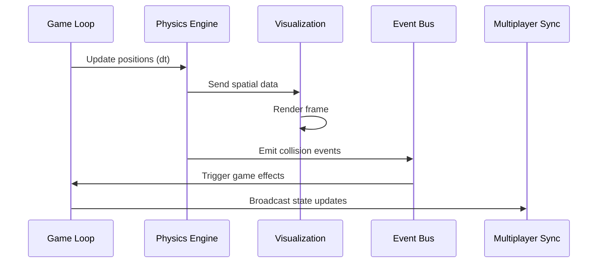

# ThreatForge Game Engine Model

## 1. Core Architecture
### Modular Structure


### Key Components
- **Event Bus**: Pub/Sub system for inter-module communication
- **Domain Plugins**: JSON manifests defining:
  - Threat types
  - Mechanics
  - Cross-domain hooks
- **Procedural Generators**: Seed-based algorithms for:
  - World creation
  - Threat evolution trees
  - Narrative branches

## 2. Game State Representation
### World State
```typescript
interface WorldState {
  regions: Region[];
  factions: Faction[];
  currentTurn: number;
  globalMetrics: {
    stability: number;
    economy: number;
    trust: number;
  };
}

interface Region {
  id: string;
  population: PopulationPyramid;
  resources: ResourcePool;
  threats: ActiveThreat[];
  attributes: {
    climateVulnerability: number;
    techLevel: number;
  };
  // Spatial properties
  boundary: [number, number][]; // Polygon coordinates [longitude, latitude]
  centroid: [number, number];   // [longitude, latitude]
  elevation: number;            // Meters above sea level
}

interface PopulationPyramid {
  ageGroups: {
    youth: number;
    adults: number;
    elderly: number;
  };
  psychodynamics: {
    trust: number;
    fear: number;
    compliance: number;
  };
}
```

### Faction System
```typescript
enum FactionType {
  TECHNOOCRAT = "Evil Technocrat",
  MITIGATOR = "Hero Mitigator",
  NATION_STATE = "Nation-State",
  RESISTANCE = "Free Human Resistance"
}

interface Faction {
  id: string;
  type: FactionType;
  resources: ResourcePool;
  objectives: Objective[];
  winConditions: {
    dominationThreshold?: number;   // % of world to control (e.g., 60)
    survivalThreshold?: number;     // Minimum stability level
    exposureCount?: number;          // Number of conspiracies to expose
    economicControlThreshold?: number; // % of resources to control
    populationControlThreshold?: number; // % population reduction
    allianceCount?: number;          // Number of alliances required
  };
  capabilities: {
    threatDeployment: boolean;
    investigation: boolean;
    influence: boolean;
    economicWarfare: boolean;
    cyberOperations: boolean;
    environmentalManipulation: boolean;
    spaceDominance: boolean;
  };
  // Spatial capabilities
  militaryUnits: MilitaryUnit[];
  satellites: Satellite[];
  sensorRange: number; // km
  movementSpeed: number; // multiplier
  // Deployment constraints
  deploymentConstraints: {
    maxUnits: number;     // Max units per region
    cooldown: number;     // Turns between deployments
    zoneRestrictions: string[]; // Allowed deployment zones
  };
}

interface Objective {
  id: string;
  type: "TERRITORIAL" | "ECONOMIC" | "INFLUENCE" | "THREAT_MITIGATION" | "THREAT_DEPLOYMENT";
  target: string; // Region ID, Faction ID, or Threat ID
  progress: number; // 0-100
  requiredProgress: number;
  rewards: {
    resources?: ResourcePool;
    reputation?: number;
    unlock?: string; // Unlockable ability or unit
  };
}

interface ResourcePool {
  funds: number;
  intel: number;
  manpower: number;
  tech: number;
}

// Spatial entity interfaces
interface MilitaryUnit {
  id: string;
  factionId: string;
  type: "INFANTRY" | "TANK" | "AIRCRAFT" | "NAVAL" | "CYBER";
  position: [number, number];   // [longitude, latitude]
  velocity: [number, number];   // [m/s east, m/s north]
  mass: number;                 // Kilograms
  energy: number;               // Joules (battery/fuel)
  abilities: UnitAbility[];     // Faction-specific special abilities
}

interface Satellite {
  id: string;
  factionId: string;
  type: "COMMS" | "RECON" | "WEAPON" | "NAVIGATION";
  orbit: {
    semiMajorAxis: number;      // km
    eccentricity: number;
    inclination: number;        // degrees
    period: number;             // seconds
  };
  position: [number, number, number]; // ECEF coordinates [x, y, z] in km
  velocity: [number, number, number]; // km/s
  mass: number;                 // kg
  abilities: UnitAbility[];     // Faction-specific special abilities
}
```

## 3. Threat Mechanics
### Threat Representation
```typescript
interface Threat {
  id: string;
  domain: ThreatDomain;
  type: "REAL" | "FAKE" | "UNKNOWN";
  severity: number;
  visibility: number;
  spreadRate: number;
  effects: ThreatEffect[];
  crossDomainImpacts: {
    domain: ThreatDomain;
    multiplier: number;
  }[];
  // Domain-specific properties
  economicImpact?: {
    marketSector: "TECH" | "ENERGY" | "FINANCE";
    volatility: number; // 0-1 scale
  };
  biologicalProperties?: {
    incubationPeriod?: number;   // in days
    mortalityRate?: number;      // 0-1
    transmissionVectors?: string[]; // e.g., ["airborne", "waterborne"]
  };
  cyberProperties?: {
    attackVector?: "NETWORK" | "PHYSICAL" | "SOCIAL";
    exploitComplexity?: number; // 0-1 scale
    zeroDay?: boolean;
  };
  environmentalProperties?: {
    temperatureSensitivity?: number; // 0-1 scale
    precipitationDependency?: number; // 0-1 scale
  };
  quantumProperties?: {
    decryptionTime?: number; // seconds
    qubitCount?: number;
  };
  radiologicalProperties?: {
    halfLife?: number; // days
    contaminationRadius?: number; // km
  };
}

type ThreatDomain =
  | "CYBER"
  | "GEO"
  | "ENV"
  | "INFO"
  | "SPACE"
  | "WMD"
  | "BIO"
  | "ECON"
  | "QUANTUM"   // Quantum computing threats
  | "RAD";      // Radiological threats

interface ThreatEffect {
  target: "POPULATION" | "ECONOMY" | "INFRASTRUCTURE";
  modifier: number; // -1.0 to 1.0
  propagation: {
    type: "DIFFUSION" | "NETWORK" | "VECTOR";
    rate: number;       // Propagation speed
    range: number;      // Effective radius in km
    persistence: number; // Duration of effect
  };
}
```

### Threat Lifecycle
1. **Generation**: Procedural creation based on domain parameters
2. **Deployment**: Faction-initiated through action system
3. **Evolution**: Mutation through cross-domain interactions
4. **Resolution**: Mitigation, escalation, or natural conclusion

## 4. Action System
### Action Types


interface Action {
  id: string;
  type: "THREAT" | "INFLUENCE" | "INVESTIGATION" | "ECONOMIC";
  name: string;
  description: string;
  resourceCost: ResourcePool;
  successProbability: number; // 0-1
  effects: {
    target: "REGION" | "FACTION" | "THREAT";
    modifier: number; // -1.0 to 1.0
    duration: number; // turns
  }[];
  cooldown: number; // turns
  requiredCapabilities: (keyof Faction['capabilities'])[];
}

### Action Execution Flow
1. Player selects action and target
2. System calculates resource costs
3. Probabilistic success determination (based on successProbability)
4. Apply effects to game state
5. Trigger narrative events
6. Update faction standing
7. Apply cooldown

## 5. Cross-Domain Interactions
### Interaction Matrix
Domain Pair | Interaction Effect | Example |
|-------------|-------------------|---------|
| Cyber + Info | 1.5x disinformation spread | AI-generated deepfakes accelerate propaganda |
| Env + Geo | 2.0x migration effects | Drought triggers border conflicts |
| WMD + Space | 3.0x detection risk | Orbital nukes increase geopolitical tension |
| Economic + Cyber | 0.5x recovery time | Ransomware extends recession duration |
| Space + Cyber | 2.2x disruption | Satellite hack disables global comms |
| Geo + Space | 1.8x escalation | Anti-satellite test sparks diplomatic crisis |
| Bio + Economic | 1.7x market panic | Lab leak causes biotech stock crash |
| Info + Economic | 2.5x volatility | Fake news triggers flash market crash |
| Quantum + Cyber | 3.0x decryption | Quantum computers break encryption in hours |
| Rad + Env | 1.8x contamination | Dirty bombs create long-term ecological damage |

### Interaction Algorithm
```
function calculateCrossImpact(threatA, threatB) {
  const baseEffect = threatA.severity * threatB.severity;
  const domainMultiplier = DOMAIN_MATRIX[threatA.domain][threatB.domain];
  const synergy = threatA.crossDomainImpacts
    .find(i => i.domain === threatB.domain)?.multiplier || 1.0;
  
  return baseEffect * domainMultiplier * synergy;
}
```

## 6. Narrative Engine
### Event Chaining


### Chronicle Generation
- **Input**: Event chain with 3+ linked events
- **Process**:
  1. Classify event types
  2. Determine narrative archetype (Betrayal, Revolution, etc.)
  3. Generate title based on domains involved
  4. Create summary with faction outcomes
- **Output**: NarrativeChain object
  ```typescript
  interface NarrativeChain {
    id: string;
    title: string;
    timeline: string[]; // Event IDs
    primaryFactions: FactionType[];
    globalImpact: number; // 0-1 scale
    keyOutcomes: string[];
    domainsInvolved: ThreatDomain[];
    turningPoint: string; // Event ID of most impactful event
    resolution: "POSITIVE" | "NEGATIVE" | "NEUTRAL";
    duration: number; // turns
  }

  // Example:
  const exampleChain: NarrativeChain = {
    id: "chain-2042",
    title: "The 2042 Cyber-Climate War",
    timeline: ["event-1", "event-2", "event-3"],
    primaryFactions: ["TECHNOCRAT", "RESISTANCE"],
    globalImpact: 0.75,
    keyOutcomes: ["Economic collapse", "Regime change"],
    domainsInvolved: ["CYBER", "ENV", "ECON"],
    turningPoint: "event-2",
    resolution: "NEGATIVE",
    duration: 12
  }
  ```
  
- **Event Weighting**:
  ```typescript
interface Event {
  id: string;
  title: string;
  description: string;
  severity: number;
  domainsInvolved: ThreatDomain[];
  factionsInvolved: FactionType[];
  crossDomainImpacts: {
    domain: ThreatDomain;
    multiplier: number;
  }[];
  location?: [number, number]; // [longitude, latitude]
  radius?: number; // km
  duration: number; // turns
  chainId?: string; // ID of event chain
}

function calculateEventWeight(event: Event) {
  return (event.severity * 0.6) +
         (event.crossDomainImpacts.length * 0.3) +
         (event.factionsInvolved.length * 0.1);
}
  ```
  
### Multiplayer Integration
- **Synchronization**: Deterministic lockstep model with WebRTC/WebSockets
- **Matchmaking**: Lobby system with faction selection and role assignment
- **Session Types**:
  - Cooperative (faction alliances against AI threats)
  - Competitive (asymmetric objectives: e.g., Technocrats vs Mitigators)
  - Free-for-all (emergent diplomacy and betrayals)
- **Cross-Platform**: Browser/desktop/mobile support via PWA
- **Persistent Worlds**: Cloud-saved games with versioned histories

## 7. Data Visualization System
### UI Components
1. **World Map View**:
   - Heatmap layers for threat concentrations
   - Faction control regions with dynamic borders
   - Resource flow vectors (animated)
   - Military unit positions and movement trails (with velocity vectors)
   - Satellite orbits and ground tracks (real-time orbital mechanics)
   - 3D terrain with elevation data and dynamic lighting
   - Threat propagation vectors (animated flow fields)

2. **Domain Dashboards**:
   - Threat evolution trees
   - Risk/reward matrices
   - Timeline projections

3. **Faction Consoles**:
   - Custom views per faction type
   - Technocrat: Threat deployment panels
   - Mitigator: Investigation tools
   - Nation-State: Diplomatic interfaces

### Data Flow


## 8. Faction Spatial Capabilities

### Faction-Specific Units
```typescript
interface Faction {
  id: string;
  type: FactionType;
  resources: ResourcePool;
  objectives: Objective[];
  capabilities: {
    threatDeployment: boolean;
    investigation: boolean;
    influence: boolean;
  };
  // Spatial capabilities
  militaryUnits: MilitaryUnit[];
  satellites: Satellite[];
  sensorRange: number; // km
  movementSpeed: number; // multiplier
  deploymentConstraints: {
    maxUnits: number;     // Max units per region
    cooldown: number;     // Turns between deployments
    zoneRestrictions: string[]; // Allowed deployment zones
  };
}
```

### Unit Deployment Costs
| Unit Type | Funds | Intel | Manpower | Tech |
|-----------|-------|-------|----------|------|
| Infantry  | 100   | 10    | 50       | 5    |
| Tank      | 500   | 30    | 20       | 20   |
| Aircraft  | 1000  | 50    | 10       | 50   |
| Naval     | 800   | 40    | 15       | 30   |
| Comms Sat | 2000  | 100   | 5        | 100  |
| Weapon Sat| 5000  | 200   | 10       | 200  |
| Quantum Node | 8000 | 300   | 5        | 400  | // For QUANTUM domain
| Rad Dispersal| 3000 | 150   | 8        | 100  | // For RAD domain

## 9. Physics Modeling

### Newtonian Mechanics Examples
**Military Unit Movement:**
```typescript
function updateTankMovement(tank: MilitaryUnit, terrainResistance: number, dt: number) {
  // Calculate net force (engine power - friction)
  const engineForce = 50000; // N (typical main battle tank)
  const frictionForce = terrainResistance * tank.mass * 9.8;
  const netForce = engineForce - frictionForce;
  
  // Update acceleration, velocity, position
  const acceleration = netForce / tank.mass;
  tank.velocity[0] += acceleration * dt * Math.cos(tank.heading);
  tank.velocity[1] += acceleration * dt * Math.sin(tank.heading);
  tank.position[0] += tank.velocity[0] * dt;
  tank.position[1] += tank.velocity[1] * dt;
  
  // Update energy (fuel consumption)
  tank.energy -= engineForce * 0.0001 * dt; // 0.0001 J/N
}
```

**Satellite Orbital Adjustment:**
```typescript
function adjustSatelliteOrbit(sat: Satellite, targetAltitude: number, dt: number) {
  const currentAlt = Math.sqrt(sat.position[0]**2 + sat.position[1]**2 + sat.position[2]**2);
  const deltaV = 0.1 * (targetAltitude - currentAlt); // Proportional control
  
  // Apply thrust in velocity direction
  const velocityDir = [
    sat.velocity[0] / Math.hypot(...sat.velocity),
    sat.velocity[1] / Math.hypot(...sat.velocity),
    sat.velocity[2] / Math.hypot(...sat.velocity)
  ];
  
  sat.velocity[0] += velocityDir[0] * deltaV;
  sat.velocity[1] += velocityDir[1] * deltaV;
  sat.velocity[2] += velocityDir[2] * deltaV;
  
  // Update orbital parameters
  updateOrbit(sat, dt);
}
```

### Orbital Mechanics
```typescript
const G = 6.67430e-11; // Gravitational constant
const EARTH_MASS = 5.972e24; // kg

function updateOrbit(satellite: Satellite, dt: number) {
  // Calculate distance from Earth center
  const r = Math.sqrt(
    satellite.position[0]**2 +
    satellite.position[1]**2 +
    satellite.position[2]**2
  );
  
  // Calculate gravitational force
  const Fg = G * EARTH_MASS * satellite.mass / r**2;
  
  // Direction vector towards Earth
  const dir = [
    -satellite.position[0]/r,
    -satellite.position[1]/r,
    -satellite.position[2]/r
  ];
  
  // Update velocity
  satellite.velocity[0] += dir[0] * Fg / satellite.mass * dt;
  satellite.velocity[1] += dir[1] * Fg / satellite.mass * dt;
  satellite.velocity[2] += dir[2] * Fg / satellite.mass * dt;
  
  // Update position
  satellite.position[0] += satellite.velocity[0] * dt;
  satellite.position[1] += satellite.velocity[1] * dt;
  satellite.position[2] += satellite.velocity[2] * dt;
  
  // Update orbital parameters
  satellite.orbit.semiMajorAxis = r;
  satellite.orbit.period = 2 * Math.PI * Math.sqrt(r**3 / (G * EARTH_MASS));
}
```

### Energy Systems
```typescript
interface EnergySystem {
  capacity: number;       // Max energy storage (Joules)
  current: number;        // Current energy
  rechargeRate: number;   // Joules per second
  consumptionRate: number;// Joules per second during operation
}

function updateEnergy(system: EnergySystem, isActive: boolean, dt: number) {
  if (isActive) {
    system.current -= system.consumptionRate * dt;
  } else {
    system.current = Math.min(
      system.capacity,
      system.current + system.rechargeRate * dt
    );
  }
}
```

## 10. Rendering System

### Visualization Pipeline


### Faction-Specific Visualization
```typescript
function getFactionView(factionType: FactionType): VisualizationProfile {
  switch(factionType) {
    case FactionType.TECHNOCRAT:
      return {
        primaryLayer: 'THREAT_DEPLOYMENT',
        secondaryLayers: ['RESOURCE_FLOW', 'POPULATION_DENSITY'],
        threatVisibility: 'ALL',
        economicIndicators: ['PROFIT_POTENTIAL']
      };
    case FactionType.MITIGATOR:
      return {
        primaryLayer: 'THREAT_IMPACT',
        secondaryLayers: ['INVESTIGATION_ZONES', 'POPULATION_VULNERABILITY'],
        threatVisibility: 'DETECTED_ONLY',
        economicIndicators: ['RECOVERY_COST']
      };
    case FactionType.NATION_STATE:
      return {
        primaryLayer: 'TERRITORIAL_CONTROL',
        secondaryLayers: ['MILITARY_DEPLOYMENTS', 'DIPLOMATIC_RELATIONS'],
        threatVisibility: 'DOMESTIC_ONLY',
        economicIndicators: ['GDP_TREND']
      };
    case FactionType.RESISTANCE:
      return {
        primaryLayer: 'INFORMATION_FLOW',
        secondaryLayers: ['UNDERGROUND_NETWORKS', 'AUTHORITY_WEAKNESS'],
        threatVisibility: 'HIDDEN_SOURCES',
        economicIndicators: ['BLACK_MARKET']
      };
    }
    
// Unit Ability Definitions
type UnitAbility =
  | { type: "STEALTH", effectiveness: number }      // Reduced detection
  | { type: "SABOTAGE", damage: number }            // Infrastructure damage
  | { type: "DECRYPT", successRate: number }        // Code breaking
  | { type: "JAMMING", radius: number }             // Signal disruption
  | { type: "SHIELD", protection: number }          // Defense boost
  | { type: "RECON", intelGain: number }            // Intelligence gathering
  | { type: "HEAL", amount: number }                // Unit healing
  | { type: "TERRAFORM", terrainModifier: number }; // Environment modification
}

// 3D Terrain Rendering
function renderTerrain(region: Region, ctx: WebGLRenderingContext) {
  const { elevation, climate } = region;
  // Generate heightmap from elevation data
  const heightMap = generateHeightMap(elevation);
  // Apply climate-based textures
  applyClimateTexture(ctx, heightMap, climate);
  // Add dynamic elements (rivers, roads)
  renderDynamicFeatures(ctx, region.features);
}
```

### Economic Data Rendering
```typescript
function renderEconomicFlow(region: Region, ctx: CanvasRenderingContext2D) {
  const { resources, economicStatus } = region;
  
  // Render resource flow arrows
  resources.imports.forEach(imp => {
    const fromPos = getRegionCenter(imp.fromRegionId);
    const toPos = getRegionCenter(region.id);
    drawArrow(ctx, fromPos, toPos,
              `rgba(0, 255, 0, ${0.3 + imp.volume * 0.7})`,
              imp.resourceType);
  });
  
  // Render economic status heatmap
  const intensity = economicStatus.stability * 0.8 + economicStatus.growth * 0.2;
  ctx.fillStyle = `rgba(255, ${255 * (1-intensity)}, 0, 0.4)`;
  ctx.fillRect(region.boundary);
}
```

## 11. Integration with Game Systems

### Physics in Game Loop


### Spatial Event Examples
| Event Type | Condition | Effect |
|------------|-----------|--------|
| Satellite pass | Satellite over region | +Intel gathering |
| Unit collision | Military units in same cell | Combat initiated |
| Threat detection | Threat in sensor range | Visibility increased |
| Orbital strike | Weapon sat in position | Regional damage |
| Economic collapse | Region stability < 20% | Faction resource penalty |

## 12. Technical Specifications

### Implementation Details
- **Frontend**: HTML5/JavaScript PWA using:
  - Phaser for core game logic
  - Three.js for 3D visualization
  - D3.js for data dashboards
- **Backend**: Client-side only with:
  - IndexedDB for persistent saves
  - Web Workers for physics simulations
- **Performance**:
  - LOD (Level of Detail) rendering
  - Spatial partitioning for entity management
  - Frame budget: 16ms (60 FPS target)
- **Ethics**:
  - Content warnings for sensitive scenarios
  - Educational mode with real-world parallels
  - Inclusive design with color-blind modes

This model provides the foundational architecture and mechanics for ThreatForge, enabling the emergent gameplay and extensibility described in the specifications. All physical elements now have spatial representations that can be modeled geometrically and physically, and rendered in map displays.
