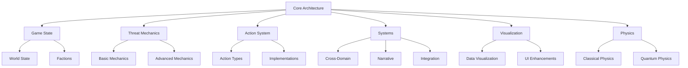

# ThreatForge Game Engine Model

This document provides an overview of the ThreatForge game engine model. The complete model has been refactored into a modular structure for better organization and maintainability. Click on the links below to explore each component.

## Core Architecture
- [Modular Structure and Key Components](engine_model/core/architecture.md)

## Game State Representation
- [World State and Faction System](engine_model/game_state/world_state.md)

## Threat Mechanics
- [Threat Representation and Domain-Specific Properties](engine_model/threats/threat_mechanics.md)
- [Advanced Threat Mechanics](engine_model/threats/advanced_threats.md)

## Action System
- [Action Types and Implementations](engine_model/actions/action_system.md)

## Systems
- [Cross-Domain Interactions](engine_model/systems/cross_domain_interactions.md)
- [Narrative Engine](engine_model/systems/narrative_engine.md)
- [System Integration](engine_model/systems/integration.md)
- [Technical Specifications](engine_model/systems/technical_specs.md)
- [Game Progression Systems](engine_model/systems/progression.md)
- [Multiplayer Enhancements](engine_model/systems/multiplayer.md)
- [Environmental Systems](engine_model/systems/environmental.md)

## Visualization
- [Data Visualization System](engine_model/visualization/data_visualization.md)
- [Player Interface Enhancements](engine_model/visualization/interface_enhancements.md)

## Physics Modeling
- [Newtonian Mechanics and Orbital Dynamics](engine_model/physics/physics_modeling.md)
- [Quantum Physics and Energy Systems](engine_model/physics/physics_modeling.md#quantum-physics-modeling)

## Full Model Diagram

This modular structure allows for easier maintenance and extension of the ThreatForge game engine model. Each component is documented in its respective file with detailed explanations and code samples.
