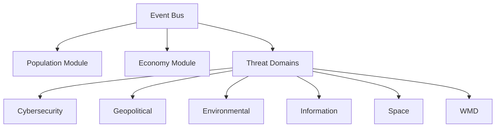
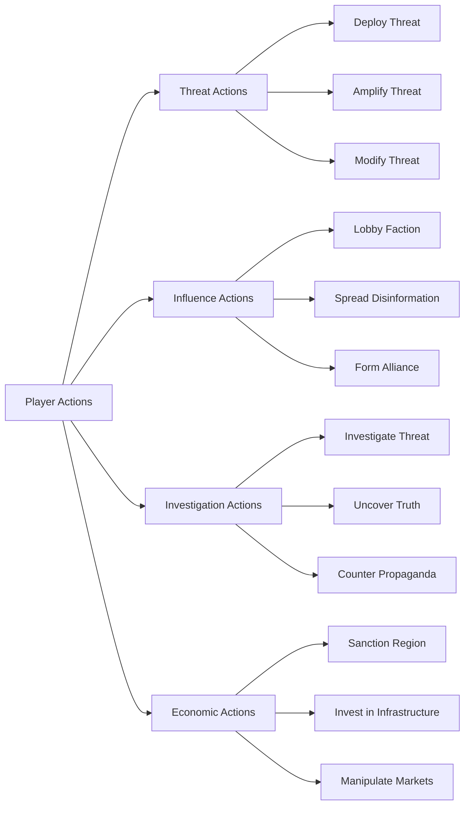
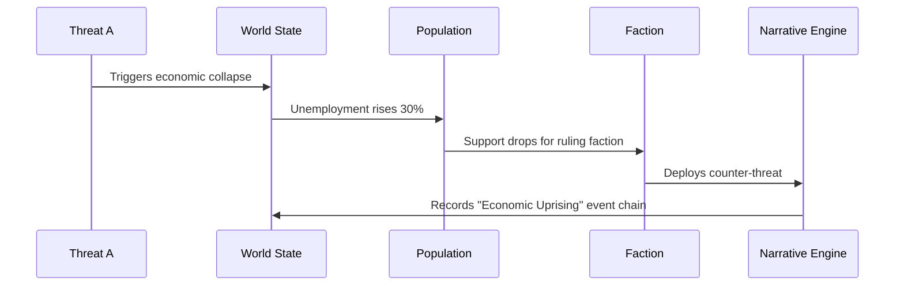
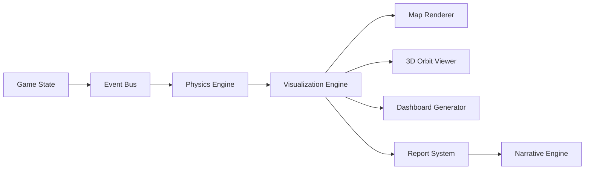
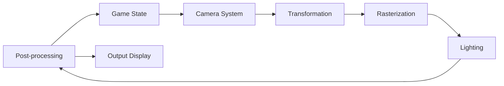

# ThreatForge Game Engine Model

## 1. Core Architecture
### Modular Structure


### Key Components
- **Event Bus**: Pub/Sub system for inter-module communication
- **Domain Plugins**: JSON manifests defining:
  - Threat types
  - Mechanics
  - Cross-domain hooks
- **Procedural Generators**: Seed-based algorithms for:
  - World creation
  - Threat evolution trees
  - Narrative branches

## 2. Game State Representation
### World State
```typescript
interface WorldState {
  regions: Region[];
  factions: Faction[];
  currentTurn: number;
  globalMetrics: {
    stability: number;
    economy: number;
    trust: number;
  };
}

interface Region {
  id: string;
  population: PopulationPyramid;
  resources: ResourcePool;
  threats: ActiveThreat[];
  attributes: {
    climateVulnerability: number;
    techLevel: number;
  };
  // Spatial properties
  boundary: [number, number][]; // Polygon coordinates [longitude, latitude]
  centroid: [number, number];   // [longitude, latitude]
  elevation: number;            // Meters above sea level
}

interface PopulationPyramid {
  ageGroups: {
    youth: number;
    adults: number;
    elderly: number;
  };
  psychodynamics: {
    trust: number;
    fear: number;
    compliance: number;
  };
}
```

### Faction System
```typescript
enum FactionType {
  TECHNOOCRAT = "Evil Technocrat",
  MITIGATOR = "Hero Mitigator",
  NATION_STATE = "Nation-State",
  RESISTANCE = "Free Human Resistance"
}

interface Faction {
  id: string;
  type: FactionType;
  resources: ResourcePool;
  objectives: Objective[];
  capabilities: {
    threatDeployment: boolean;
    investigation: boolean;
    influence: boolean;
  };
}

interface ResourcePool {
  funds: number;
  intel: number;
  manpower: number;
  tech: number;
}

// Spatial entity interfaces
interface MilitaryUnit {
  id: string;
  factionId: string;
  type: "INFANTRY" | "TANK" | "AIRCRAFT" | "NAVAL" | "CYBER";
  position: [number, number];   // [longitude, latitude]
  velocity: [number, number];   // [m/s east, m/s north]
  mass: number;                 // Kilograms
  energy: number;               // Joules (battery/fuel)
}

interface Satellite {
  id: string;
  factionId: string;
  type: "COMMS" | "RECON" | "WEAPON" | "NAVIGATION";
  orbit: {
    semiMajorAxis: number;      // km
    eccentricity: number;
    inclination: number;        // degrees
    period: number;             // seconds
  };
  position: [number, number, number]; // ECEF coordinates [x, y, z] in km
  velocity: [number, number, number]; // km/s
  mass: number;                 // kg
}
```

## 3. Threat Mechanics
### Threat Representation
```typescript
interface Threat {
  id: string;
  domain: ThreatDomain;
  type: "REAL" | "FAKE" | "UNKNOWN";
  severity: number;
  visibility: number;
  spreadRate: number;
  effects: ThreatEffect[];
  crossDomainImpacts: {
    domain: ThreatDomain;
    multiplier: number;
  }[];
}

type ThreatDomain = 
  | "CYBER"
  | "GEO"
  | "ENV"
  | "INFO"
  | "SPACE"
  | "WMD"
  | "BIO";

interface ThreatEffect {
  target: "POPULATION" | "ECONOMY" | "INFRASTRUCTURE";
  modifier: number; // -1.0 to 1.0
}
```

### Threat Lifecycle
1. **Generation**: Procedural creation based on domain parameters
2. **Deployment**: Faction-initiated through action system
3. **Evolution**: Mutation through cross-domain interactions
4. **Resolution**: Mitigation, escalation, or natural conclusion

## 4. Action System
### Action Types


### Action Execution Flow
1. Player selects action and target
2. System calculates resource costs
3. Probabilistic success determination
4. Apply effects to game state
5. Trigger narrative events
6. Update faction standing

## 5. Cross-Domain Interactions
### Interaction Matrix
| Domain Pair | Interaction Effect | Example |
|-------------|-------------------|---------|
| Cyber + Info | 1.5x disinformation spread | AI-generated deepfakes accelerate propaganda |
| Env + Geo | 2.0x migration effects | Drought triggers border conflicts |
| WMD + Space | 3.0x detection risk | Orbital nukes increase geopolitical tension |
| Economic + Cyber | 0.5x recovery time | Ransomware extends recession duration |
| Space + Cyber | 2.2x disruption | Satellite hack disables global comms |
| Geo + Space | 1.8x escalation | Anti-satellite test sparks diplomatic crisis |

### Interaction Algorithm
```
function calculateCrossImpact(threatA, threatB) {
  const baseEffect = threatA.severity * threatB.severity;
  const domainMultiplier = DOMAIN_MATRIX[threatA.domain][threatB.domain];
  const synergy = threatA.crossDomainImpacts
    .find(i => i.domain === threatB.domain)?.multiplier || 1.0;
  
  return baseEffect * domainMultiplier * synergy;
}
```

## 6. Narrative Engine
### Event Chaining


### Chronicle Generation
- **Input**: Event chain with 3+ linked events
- **Process**: 
  1. Classify event types
  2. Determine narrative archetype (Betrayal, Revolution, etc.)
  3. Generate title based on domains involved
  4. Create summary with faction outcomes
- **Output**: 
  ```json
  {
    "title": "The 2042 Cyber-Climate War",
    "timeline": [/* event IDs */],
    "primaryFactions": ["TECHNOCRAT", "RESISTANCE"],
    "globalImpact": 0.75,
    "keyOutcomes": ["Economic collapse", "Regime change"]
  }
  ```

## 7. Data Visualization System
### UI Components
1. **World Map View**:
   - Heatmap layers for threat concentrations
   - Faction control regions with dynamic borders
   - Resource flow vectors (animated)
   - Military unit positions and movement trails
   - Satellite orbits and ground tracks
   - 3D terrain with elevation data

2. **Domain Dashboards**:
   - Threat evolution trees
   - Risk/reward matrices
   - Timeline projections

3. **Faction Consoles**:
   - Custom views per faction type
   - Technocrat: Threat deployment panels
   - Mitigator: Investigation tools
   - Nation-State: Diplomatic interfaces

### Data Flow


## 8. Faction Spatial Capabilities

### Faction-Specific Units
```typescript
interface Faction {
  id: string;
  type: FactionType;
  resources: ResourcePool;
  objectives: Objective[];
  capabilities: {
    threatDeployment: boolean;
    investigation: boolean;
    influence: boolean;
  };
  // Spatial capabilities
  militaryUnits: MilitaryUnit[];
  satellites: Satellite[];
  sensorRange: number; // km
  movementSpeed: number; // multiplier
}
```

### Unit Deployment Costs
| Unit Type | Funds | Intel | Manpower | Tech |
|-----------|-------|-------|----------|------|
| Infantry  | 100   | 10    | 50       | 5    |
| Tank      | 500   | 30    | 20       | 20   |
| Aircraft  | 1000  | 50    | 10       | 50   |
| Naval     | 800   | 40    | 15       | 30   |
| Comms Sat | 2000  | 100   | 5        | 100  |
| Weapon Sat| 5000  | 200   | 10       | 200  |

## 9. Physics Modeling

### Newtonian Mechanics
```typescript
interface PhysicalEntity {
  id: string;
  position: [number, number, number]; // [x, y, z] in meters
  velocity: [number, number, number]; // [vx, vy, vz] in m/s
  mass: number;                      // kg
  forces: [number, number, number];  // [fx, fy, fz] in Newtons
}

function updatePhysics(entity: PhysicalEntity, dt: number) {
  // Calculate acceleration: a = F/m
  const ax = entity.forces[0] / entity.mass;
  const ay = entity.forces[1] / entity.mass;
  const az = entity.forces[2] / entity.mass;
  
  // Update velocity: v = v0 + a*dt
  entity.velocity[0] += ax * dt;
  entity.velocity[1] += ay * dt;
  entity.velocity[2] += az * dt;
  
  // Update position: p = p0 + v*dt
  entity.position[0] += entity.velocity[0] * dt;
  entity.position[1] += entity.velocity[1] * dt;
  entity.position[2] += entity.velocity[2] * dt;
  
  // Reset forces for next frame
  entity.forces = [0, 0, 0];
}
```

### Orbital Mechanics
```typescript
const G = 6.67430e-11; // Gravitational constant
const EARTH_MASS = 5.972e24; // kg

function updateOrbit(satellite: Satellite, dt: number) {
  // Calculate distance from Earth center
  const r = Math.sqrt(
    satellite.position[0]**2 +
    satellite.position[1]**2 +
    satellite.position[2]**2
  );
  
  // Calculate gravitational force
  const Fg = G * EARTH_MASS * satellite.mass / r**2;
  
  // Direction vector towards Earth
  const dir = [
    -satellite.position[0]/r,
    -satellite.position[1]/r,
    -satellite.position[2]/r
  ];
  
  // Update velocity
  satellite.velocity[0] += dir[0] * Fg / satellite.mass * dt;
  satellite.velocity[1] += dir[1] * Fg / satellite.mass * dt;
  satellite.velocity[2] += dir[2] * Fg / satellite.mass * dt;
  
  // Update position
  satellite.position[0] += satellite.velocity[0] * dt;
  satellite.position[1] += satellite.velocity[1] * dt;
  satellite.position[2] += satellite.velocity[2] * dt;
}
```

### Energy Systems
```typescript
interface EnergySystem {
  capacity: number;       // Max energy storage (Joules)
  current: number;        // Current energy
  rechargeRate: number;   // Joules per second
  consumptionRate: number;// Joules per second during operation
}

function updateEnergy(system: EnergySystem, isActive: boolean, dt: number) {
  if (isActive) {
    system.current -= system.consumptionRate * dt;
  } else {
    system.current = Math.min(
      system.capacity,
      system.current + system.rechargeRate * dt
    );
  }
}
```

## 9. Rendering System

### Spatial Rendering Pipeline


### Map Projection
```typescript
function projectToMap(
  position: [number, number, number],
  mapCenter: [number, number],
  zoom: number
): [number, number] {
  // Convert 3D position to 2D map coordinates
  const [lon, lat, alt] = position;
  const scale = Math.pow(2, zoom) * 256 / 360;
  const x = (lon - mapCenter[0]) * scale;
  const y = (lat - mapCenter[1]) * scale * Math.cos(lat * Math.PI/180);
  return [x, y];
}
```

This model provides the foundational architecture and mechanics for ThreatForge, enabling the emergent gameplay and extensibility described in the specifications.
