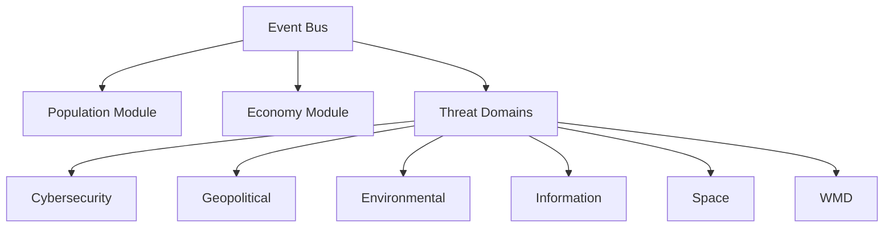
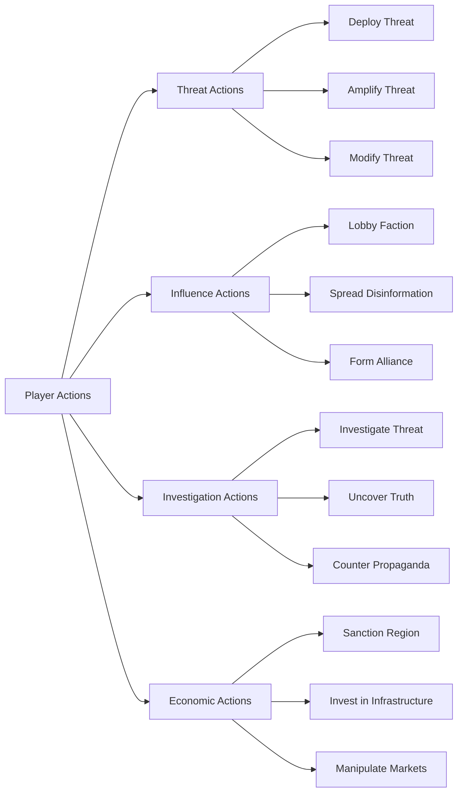
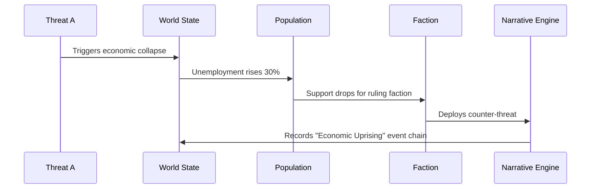
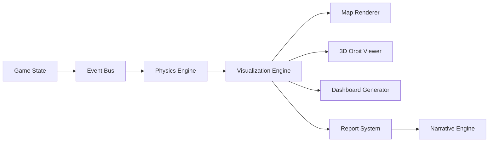
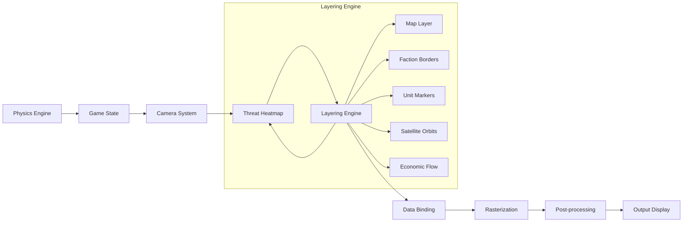
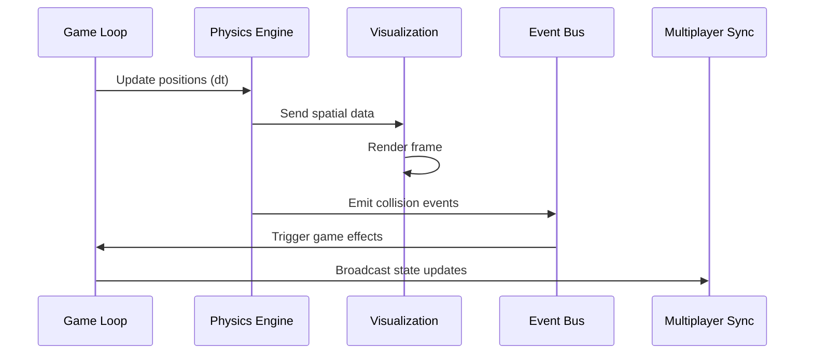
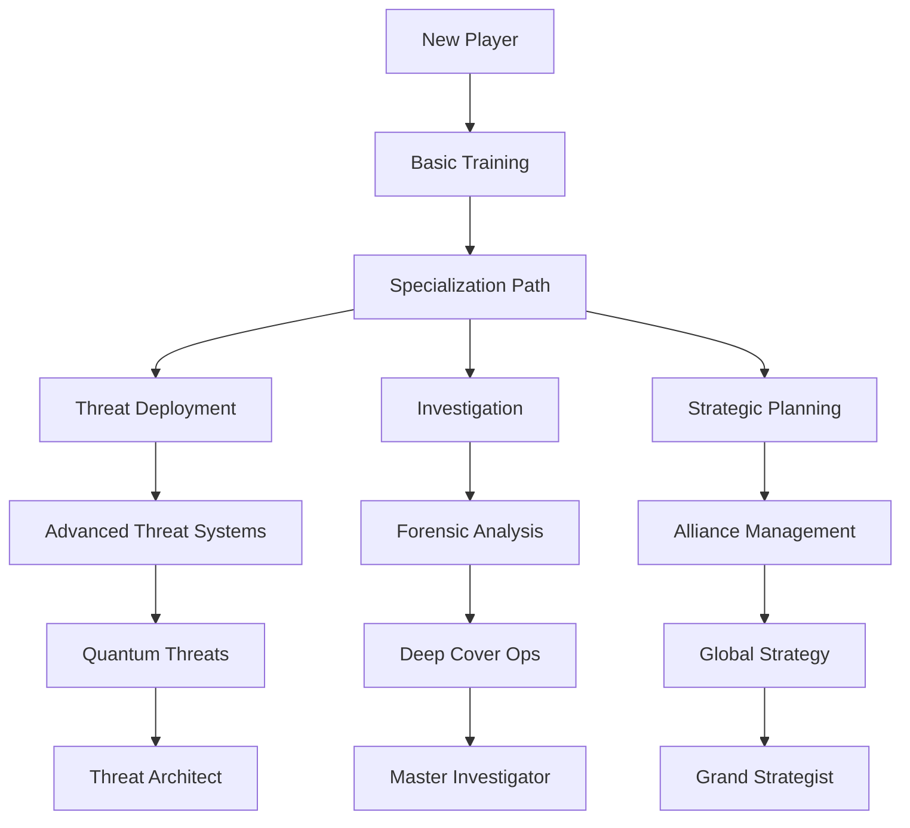
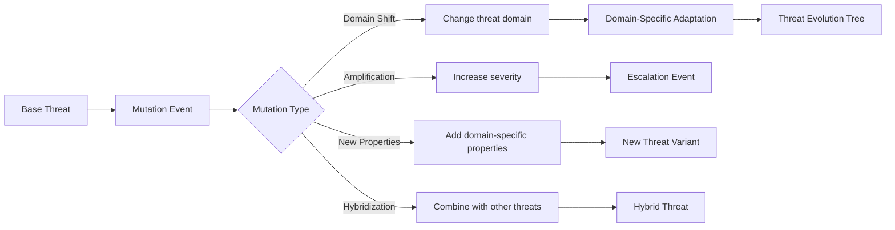

# ThreatForge Game Engine Model

## 1. Core Architecture

### Modular Structure


### Key Components
- **Event Bus**: Pub/Sub system for inter-module communication
- **Domain Plugins**: JSON manifests defining:
  - Threat types
  - Mechanics
  - Cross-domain hooks
- **Procedural Generators**: Seed-based algorithms for:
  - World creation
  - Threat evolution trees
  - Narrative branches

## 2. Game State Representation

### World State
```typescript
interface WorldState {
  regions: Region[];
  factions: Faction[];
  currentTurn: number;
  globalMetrics: {
    stability: number;
    economy: number;
    trust: number;
  };
}

interface Region {
  id: string;
  population: PopulationPyramid;
  resources: ResourcePool;
  threats: ActiveThreat[];
  attributes: {
    climateVulnerability: number;
    techLevel: number;
  };
  // Spatial properties
  boundary: [number, number][]; // Polygon coordinates [longitude, latitude]
  centroid: [number, number];   // [longitude, latitude]
  elevation: number;            // Meters above sea level
}

interface PopulationPyramid {
  ageGroups: {
    youth: number;
    adults: number;
    elderly: number;
  };
  psychodynamics: {
    trust: number;
    fear: number;
    compliance: number;
  };
}
```

### Faction System
```typescript
enum FactionType {
  TECHNOOCRAT = "Evil Technocrat",
  MITIGATOR = "Hero Mitigator",
  NATION_STATE = "Nation-State",
  RESISTANCE = "Free Human Resistance",
  HERO_DOCTOR = "Hero Doctor/Scientist",
  PHARMA = "Pharma Conglomerate",
  CONTROLLED_OPPOSITION = "Controlled Opposition"
}

interface Faction {
  id: string;
  type: FactionType;
  resources: ResourcePool;
  objectives: Objective[];
  winConditions: {
    dominationThreshold?: number;   // % of world to control (e.g., 60)
    survivalThreshold?: number;     // Minimum stability level
    exposureCount?: number;          // Number of conspiracies to expose
    economicControlThreshold?: number; // % of resources to control
    populationControlThreshold?: number; // % population reduction
    allianceCount?: number;          // Number of alliances required
  };
  capabilities: {
    threatDeployment: boolean;
    investigation: boolean;
    influence: boolean;
    economicWarfare: boolean;
    cyberOperations: boolean;
    environmentalManipulation: boolean;
    spaceDominance: boolean;
    // Faction-specific capabilities
    aiAssistedDesign?: boolean;       // For TECHNOOCRAT and PHARMA
    mediaPropaganda?: boolean;         // For CONTROLLED_OPPOSITION
    whistleblowerNetworks?: boolean;   // For RESISTANCE and HERO_DOCTOR
    diplomaticImmunity?: boolean;      // For NATION_STATE
  };
  // Spatial capabilities
  militaryUnits: MilitaryUnit[];
  satellites: Satellite[];
  sensorRange: number; // km
  movementSpeed: number; // multiplier
  // Deployment constraints
  deploymentConstraints: {
    maxUnits: number;     // Max units per region
    cooldown: number;     // Turns between deployments
    zoneRestrictions: string[]; // Allowed deployment zones
  };
}

interface Objective {
  id: string;
  type: "TERRITORIAL" | "ECONOMIC" | "INFLUENCE" | "THREAT_MITIGATION" | "THREAT_DEPLOYMENT";
  target: string; // Region ID, Faction ID, or Threat ID
  progress: number; // 0-100
  requiredProgress: number;
  rewards: {
    resources?: ResourcePool;
    reputation?: number;
    unlock?: string; // Unlockable ability or unit
  };
}

interface ResourcePool {
  funds: number;
  intel: number;
  manpower: number;
  tech: number;
}

// Spatial entity interfaces
interface MilitaryUnit {
  id: string;
  factionId: string;
  type: "INFANTRY" | "TANK" | "AIRCRAFT" | "NAVAL" | "CYBER" | "DRONE" | "AUTONOMOUS_GROUND" | "ROBOTIC_SWARM" | "QUANTUM_NODE" | "RAD_DISPERSAL";
  position: [number, number];   // [longitude, latitude]
  velocity: [number, number];   // [m/s east, m/s north]
  mass: number;                 // Kilograms
  energy: number;               // Joules (battery/fuel)
  autonomyLevel: number;        // 0-1 scale (0: remote, 1: fully autonomous)
  abilities: UnitAbility[];     // Faction-specific special abilities
}

interface Satellite {
  id: string;
  factionId: string;
  type: "COMMS" | "RECON" | "WEAPON" | "NAVIGATION";
  orbit: {
    semiMajorAxis: number;      // km
    eccentricity: number;
    inclination: number;        // degrees
    period: number;             // seconds
  };
  position: [number, number, number]; // ECEF coordinates [x, y, z] in km
  velocity: [number, number, number]; // km/s
  mass: number;                 // kg
  abilities: UnitAbility[];     // Faction-specific special abilities
}

## 3. Threat Mechanics

### Threat Representation
```typescript
interface Threat {
  id: string;
  domain: ThreatDomain;
  type: "REAL" | "FAKE" | "UNKNOWN";  // Fake threats cause psych damage, unknown require investigation
  detectionRisk: number;               // 0-1 probability of being discovered
  investigationProgress: number;       // 0-100, only for unknown threats
  severity: number;
  visibility: number;
  spreadRate: number;
  effects: ThreatEffect[];
  crossDomainImpacts: {
    domain: ThreatDomain;
    multiplier: number;
  }[];
  // Domain-specific properties
  economicImpact?: {
    marketSector: "TECH" | "ENERGY" | "FINANCE" | "INFRASTRUCTURE";
    volatility: number; // 0-1 scale
    // Energy infrastructure accidents
    infrastructureType?: "NUCLEAR" | "PETROLEUM" | "GRID" | "RENEWABLE";
    accidentSeverity?: number; // 0-1 scale
    coverupDifficulty?: number; // 0-1 scale
  };
  biologicalProperties?: {
    incubationPeriod?: number;   // in days
    mortalityRate?: number;      // 0-1
    transmissionVectors?: string[]; // e.g., ["airborne", "waterborne"]
  };
  cyberProperties?: {
    attackVector?: "NETWORK" | "PHYSICAL" | "SOCIAL";
    exploitComplexity?: number; // 0-1 scale
    zeroDay?: boolean;
  };
  environmentalProperties?: {
    temperatureSensitivity?: number; // 0-1 scale
    precipitationDependency?: number; // 0-1 scale
    // Weather and geological events
    weatherEvents?: string[]; // e.g., ["HURRICANE", "DROUGHT"]
    geologicalEvents?: string[]; // e.g., ["EARTHQUAKE", "VOLCANO"]
    severityScale?: number; // 1-10 scale for event intensity
  };
  quantumProperties?: {
    decryptionTime?: number; // seconds
    qubitCount?: number;
  };
  radiologicalProperties?: {
    halfLife?: number; // days
    contaminationRadius?: number; // km
  };
}

type ThreatDomain =
  | "CYBER"
  | "GEO"
  | "ENV"
  | "INFO"
  | "SPACE"
  | "WMD"
  | "BIO"
  | "ECON"
  | "QUANTUM"   // Quantum computing threats
  | "RAD"       // Radiological threats
  | "ROBOT";    // Robotics and autonomous systems

interface ThreatEffect {
  target: "POPULATION" | "ECONOMY" | "INFRASTRUCTURE" | "PSYCHE";
  modifier: number; // -1.0 to 1.0
  // Population trauma types
  traumaType?: "ETHNIC" | "ORGAN_HARVEST" | "WAR_CRIME" | "DISPLACEMENT";
  severity: number; // 0-1 scale
  propagation: {
    type: "DIFFUSION" | "NETWORK" | "VECTOR" | "SOCIAL_MEDIA";
    rate: number;       // Propagation speed
    range: number;      // Effective radius in km
    persistence: number; // Duration of effect
  };
}

## 4. Action System

### Action Types


interface Action {
  id: string;
  type: "THREAT" | "INFLUENCE" | "INVESTIGATION" | "ECONOMIC";
  name: string;
  description: string;
  resourceCost: ResourcePool;
  successProbability: number; // 0-1
  effects: {
    target: "REGION" | "FACTION" | "THREAT";
    modifier: number; // -1.0 to 1.0
    duration: number; // turns
  }[];
  cooldown: number; // turns
  requiredCapabilities: (keyof Faction['capabilities'])[];
}

## 5. Cross-Domain Interactions

### Interaction Matrix
Domain Pair | Interaction Effect | Example |
|-------------|-------------------|---------|
| Cyber + Info | 1.5x disinformation spread | AI-generated deepfakes accelerate propaganda |
| Env + Geo | 2.0x migration effects | Drought triggers border conflicts |
| WMD + Space | 3.0x detection risk | Orbital nukes increase geopolitical tension |
| Economic + Cyber | 0.5x recovery time | Ransomware extends recession duration |
| Space + Cyber | 2.2x disruption | Satellite hack disables global comms |
| Geo + Space | 1.8x escalation | Anti-satellite test sparks diplomatic crisis |
| Bio + Economic | 1.7x market panic | Lab leak causes biotech stock crash |
| Info + Economic | 2.5x volatility | Fake news triggers flash market crash |
| Quantum + Cyber | 3.0x decryption | Quantum computers break encryption in hours |
| Rad + Env | 1.8x contamination | Dirty bombs create long-term ecological damage |
| Robot + Cyber | 2.5x autonomy | Hacked robots turn against owners |
| Robot + Info | 1.7x deception | Robot networks spread disinformation |
| Robot + Bio | 3.0x horror | Robotic organ harvesting operations |

### Interaction Algorithm
```typescript
function calculateCrossImpact(threatA, threatB) {
  // Base effect from threat severities
  const baseEffect = threatA.severity * threatB.severity;
  const domainMultiplier = DOMAIN_MATRIX[threatA.domain][threatB.domain];
  // Domain-specific synergy multipliers
  const synergy = threatA.crossDomainImpacts
    .find(i => i.domain === threatB.domain)?.multiplier || 1.0;
  
  // Environmental modifiers based on region attributes
  const regionModifier = calculateRegionModifier(threatA.region, threatB.region);
  
  // Temporal decay factor for long-term threats
  const timeFactor = Math.exp(-0.1 * Math.abs(threatA.age - threatB.age));
    .find(i => i.domain === threatB.domain)?.multiplier || 1.0;
  
  return baseEffect * domainMultiplier * synergy * regionModifier * timeFactor;
}
```

## 6. Narrative Engine

### Event Chaining


### Chronicle Generation
- **Input**: Event chain with 3+ linked events
- **Process**:
  1. Classify event types
  2. Determine narrative archetype (Betrayal, Revolution, etc.)
  3. Generate title based on domains involved
  4. Create summary with faction outcomes
- **Output**: NarrativeChain object
  ```typescript
  interface NarrativeChain {
    id: string;
    title: string;
    timeline: string[]; // Event IDs
    primaryFactions: FactionType[];
    globalImpact: number; // 0-1 scale
    keyOutcomes: string[];
    domainsInvolved: ThreatDomain[];
    turningPoint: string; // Event ID of most impactful event
    resolution: "POSITIVE" | "NEGATIVE" | "NEUTRAL";
    duration: number; // turns
  }
  
  // Example:
  const exampleChain: NarrativeChain = {
    // Cyber-Climate war example
    id: "chain-2042",
    title: "The 2042 Cyber-Climate War",
    timeline: ["event-1", "event-2", "event-3"],
    primaryFactions: ["TECHNOCRAT", "RESISTANCE"],
    globalImpact: 0.75,
    keyOutcomes: ["Economic collapse", "Regime change"],
    domainsInvolved: ["CYBER", "ENV", "ECON"],
    turningPoint: "event-2",
    resolution: "NEGATIVE",
    duration: 12
  }
  
  // Pharma faction example
  const pharmaChain: NarrativeChain = {
    id: "chain-2043a",
    title: "The Cure Monopoly Crisis",
    timeline: ["event-7", "event-8", "event-9"],
    primaryFactions: ["PHARMA", "NATION_STATE"],
    globalImpact: 0.65,
    keyOutcomes: ["Vaccine apartheid", "Black market cures"],
    domainsInvolved: ["BIO", "ECON", "INFO"],
    turningPoint: "event-8",
    resolution: "NEGATIVE",
    duration: 18
  }
  
  // Hero Doctor faction example
  const heroChain: NarrativeChain = {
    id: "chain-2044",
    title: "The Whistleblower Protocol",
    timeline: ["event-10", "event-11", "event-12"],
    primaryFactions: ["HERO_DOCTOR", "RESISTANCE"],
    globalImpact: 0.55,
    keyOutcomes: ["Lab leak exposed", "Research shutdown"],
    domainsInvolved: ["BIO", "INFO", "CYBER"],
    turningPoint: "event-11",
    resolution: "POSITIVE",
    duration: 6
  }
  
  // Quantum computing threat example
  const quantumChain: NarrativeChain = {
    id: "chain-2045",
    title: "The Quantum Decryption Crisis",
    timeline: ["event-13", "event-14", "event-15"],
    primaryFactions: ["TECHNOCRAT", "MITIGATOR"],
    globalImpact: 0.85,
    keyOutcomes: ["Encryption collapse", "Data sovereignty war"],
    domainsInvolved: ["QUANTUM", "CYBER", "INFO"],
    turningPoint: "event-14",
    resolution: "NEGATIVE",
    duration: 10
  };
  
  // EMP warfare example
  const empChain: NarrativeChain = {
    id: "chain-2046",
    title: "The Great Electronic Blackout",
    timeline: ["event-16", "event-17", "event-18"],
    primaryFactions: ["RESISTANCE", "NATION_STATE"],
    globalImpact: 0.78,
    keyOutcomes: ["Grid collapse", "Analog resurgence"],
    domainsInvolved: ["CYBER", "MIL", "ECON"],
    turningPoint: "event-17",
    resolution: "NEUTRAL",
    duration: 14
  };
  
  // Environmental bio-weapon example
  const bioChain: NarrativeChain = {
    id: "chain-2047",
    title: "The Bioremediation Disaster",
    timeline: ["event-19", "event-20", "event-21"],
    primaryFactions: ["PHARMA", "ENVIRONMENTAL"],
    globalImpact: 0.68,
    keyOutcomes: ["Ecosystem collapse", "Regulatory overhaul"],
    domainsInvolved: ["BIO", "ENV", "INFO"],
    turningPoint: "event-20",
    resolution: "NEGATIVE",
    duration: 9
  };
  
  // Updated robot domain example
  const robotChain: NarrativeChain = {
    id: "chain-2043",
    title: "The Robotic Uprising of 2043",
    timeline: ["event-4", "event-5", "event-6"],
    primaryFactions: ["TECHNOCRAT", "RESISTANCE"],
    globalImpact: 0.9,
    keyOutcomes: ["AI takeover", "Human resistance"],
    domainsInvolved: ["ROBOT", "CYBER", "INFO"],
    turningPoint: "event-5",
    resolution: "NEGATIVE",
    duration: 8
  }
```

### Event Weighting
```typescript
interface Event {
  id: string;
  title: string;
  description: string;
  severity: number;
  domainsInvolved: ThreatDomain[];
  factionsInvolved: FactionType[];
  crossDomainImpacts: {
    domain: ThreatDomain;
    multiplier: number;
  }[];
  location?: [number, number]; // [longitude, latitude]
  radius?: number; // km
  duration: number; // turns
  chainId?: string; // ID of event chain
}

function calculateEventWeight(event: Event) {
  return (event.severity * 0.6) +
         (event.crossDomainImpacts.length * 0.3) +
         (event.factionsInvolved.length * 0.1);
}
```

## 7. Data Visualization System

### UI Components
1. **World Map View**:
   - Heatmap layers for threat concentrations
   - Faction control regions with dynamic borders
   - Resource flow vectors (animated)
   - Military unit positions and movement trails (with velocity vectors)
   - Satellite orbits and ground tracks (real-time orbital mechanics)
   - 3D terrain with elevation data and dynamic lighting
   - Threat propagation vectors (animated flow fields)

2. **Domain Dashboards**:
   - Threat evolution trees
   - Risk/reward matrices
   - Timeline projections

3. **Faction Consoles**:
   - Custom views per faction type
   - Technocrat: Threat deployment panels
   - Mitigator: Investigation tools
   - Nation-State: Diplomatic interfaces

### Data Flow


## 8. Faction Spatial Capabilities

### Faction-Specific Units
```typescript
interface Faction {
  id: string;
  type: FactionType;
  resources: ResourcePool;
  objectives: Objective[];
  capabilities: {
    threatDeployment: boolean;
    investigation: boolean;
    influence: boolean;
  };
  // Spatial capabilities
  militaryUnits: MilitaryUnit[];
  satellites: Satellite[];
  sensorRange: number; // km
  movementSpeed: number; // multiplier
  deploymentConstraints: {
    maxUnits: number;     // Max units per region
    cooldown: number;     // Turns between deployments
    zoneRestrictions: string[]; // Allowed deployment zones
  };
}
```

### Unit Deployment Costs
| Unit Type | Funds | Intel | Manpower | Tech | Domain |
|-----------|-------|-------|----------|------|--------|
| Infantry  | 100   | 10    | 50       | 5    | MIL    |
| Tank      | 500   | 30    | 20       | 20   | MIL    |
| Aircraft  | 1000  | 50    | 10       | 50   | MIL    |
| Naval     | 800   | 40    | 15       | 30   | MIL    |
| Comms Sat | 2000  | 100   | 5        | 100  | SPACE  |
| Weapon Sat| 5000  | 200   | 10       | 200  | SPACE  |
| Quantum Node | 8000 | 300   | 5        | 400  | QUANTUM|
| Rad Dispersal| 3000 | 150   | 8        | 100  | RAD    |
| Drone     | 1500  | 80    | 3        | 120  | ROBOT  |
| Autonomous Ground | 2500 | 120   | 5        | 180  | ROBOT  |
| Robotic Swarm | 3500 | 200   | 10       | 250  | ROBOT  |
| Bio Lab   | 4000  | 200   | 20       | 150  | BIO    | // Research and containment facility
| Info Hub  | 1500  | 300   | 10       | 100  | INFO   | // Propaganda and intelligence center
| Quantum Lab | 6000 | 400  | 15       | 300  | QUANTUM| // Quantum threat research
| EMP Drone | 2000  | 150   | 5        | 200  | CYBER  | // Electronic warfare unit

## 9. Physics Modeling

### Newtonian Mechanics Examples
**Military Unit Movement:**
```typescript
function updateTankMovement(tank: MilitaryUnit, terrainResistance: number, dt: number) {
  // Calculate net force (engine power - friction)
  const engineForce = 50000; // N (typical main battle tank)
  const frictionForce = terrainResistance * tank.mass * 9.8;
  const netForce = engineForce - frictionForce;
  
  // Update acceleration, velocity, position
  const acceleration = netForce / tank.mass;
  tank.velocity[0] += acceleration * dt * Math.cos(tank.heading);
  tank.velocity[1] += acceleration * dt * Math.sin(tank.heading);
  tank.position[0] += tank.velocity[0] * dt;
  tank.position[1] += tank.velocity[1] * dt;
  
  // Update energy (fuel consumption)
  tank.energy -= engineForce * 0.0001 * dt; // 0.0001 J/N
}
```

**Satellite Orbital Adjustment:**
```typescript
function adjustSatelliteOrbit(sat: Satellite, targetAltitude: number, dt: number) {
  const currentAlt = Math.sqrt(sat.position[0]**2 + sat.position[1]**2 + sat.position[2]**2);
  const deltaV = 0.1 * (targetAltitude - currentAlt); // Proportional control
  
  // Apply thrust in velocity direction
  const velocityDir = [
    sat.velocity[0] / Math.hypot(...sat.velocity),
    sat.velocity[1] / Math.hypot(...sat.velocity),
    sat.velocity[2] / Math.hypot(...sat.velocity)
  ];
  
  sat.velocity[0] += velocityDir[0] * deltaV;
  sat.velocity[1] += velocityDir[1] * deltaV;
  sat.velocity[2] += velocityDir[2] * deltaV;
  
  // Update orbital parameters
  updateOrbit(sat, dt);
}
```

### Orbital Mechanics
```typescript
const G = 6.67430e-11; // Gravitational constant
const EARTH_MASS = 5.972e24; // kg

function updateOrbit(satellite: Satellite, dt: number) {
  // Calculate distance from Earth center
  const r = Math.sqrt(
    satellite.position[0]**2 +
    satellite.position[1]**2 +
    satellite.position[2]**2
  );
  
  // Calculate gravitational force
  const Fg = G * EARTH_MASS * satellite.mass / r**2;
  
  // Direction vector towards Earth
  const dir = [
    -satellite.position[0]/r,
    -satellite.position[1]/r,
    -satellite.position[2]/r
  ];
  
  // Update velocity
  satellite.velocity[0] += dir[0] * Fg / satellite.mass * dt;
  satellite.velocity[1] += dir[1] * Fg / satellite.mass * dt;
  satellite.velocity[2] += dir[2] * Fg / satellite.mass * dt;
  
  // Update position
  satellite.position[0] += satellite.velocity[0] * dt;
  satellite.position[1] += satellite.velocity[1] * dt;
  satellite.position[2] += satellite.velocity[2] * dt;
  
  // Update orbital parameters
  satellite.orbit.semiMajorAxis = r;
  satellite.orbit.period = 2 * Math.PI * Math.sqrt(r**3 / (G * EARTH_MASS));
}
```

### Energy Systems
```typescript
// Military unit energy consumption modifiers
const UNIT_ENERGY_MODIFIERS = {
  "INFANTRY": 1.0,
  "TANK": 1.8,
  "AIRCRAFT": 3.0,
  "NAVAL": 2.5,
  "CYBER": 0.5,
  "DRONE": 1.2,
  "QUANTUM_NODE": 5.0,
  "RAD_DISPERSAL": 2.0
};

interface EnergySystem {
  capacity: number;       // Max energy storage (Joules)
  current: number;        // Current energy
  rechargeRate: number;   // Joules per second
  consumptionRate: number;// Joules per second during operation
}

function updateEnergy(system: EnergySystem, isActive: boolean, dt: number) {
  if (isActive) {
    system.current -= system.consumptionRate * dt;
  } else {
    system.current = Math.min(
      system.capacity,
      system.current + system.rechargeRate * dt
    );
  }
}
```

## 10. Rendering System

### Visualization Pipeline


### Faction-Specific Visualization
```typescript
function getFactionView(factionType: FactionType): VisualizationProfile {
  switch(factionType) {
    case FactionType.TECHNOCRAT:
      return {
        primaryLayer: 'THREAT_DEPLOYMENT',
        secondaryLayers: ['RESOURCE_FLOW', 'POPULATION_DENSITY'],
        threatVisibility: 'ALL',
        economicIndicators: ['PROFIT_POTENTIAL']
      };
    case FactionType.MITIGATOR:
      return {
        primaryLayer: 'THREAT_IMPACT',
        secondaryLayers: ['INVESTIGATION_ZONES', 'POPULATION_VULNERABILITY'],
        threatVisibility: 'DETECTED_ONLY',
        economicIndicators: ['RECOVERY_COST']
      };
    case FactionType.NATION_STATE:
      return {
        primaryLayer: 'TERRITORIAL_CONTROL',
        secondaryLayers: ['MILITARY_DEPLOYMENTS', 'DIPLOMATIC_RELATIONS'],
        threatVisibility: 'DOMESTIC_ONLY',
        economicIndicators: ['GDP_TREND']
      };
    case FactionType.RESISTANCE:
      return {
        primaryLayer: 'INFORMATION_FLOW',
        secondaryLayers: ['UNDERGROUND_NETWORKS', 'AUTHORITY_WEAKNESS'],
        threatVisibility: 'HIDDEN_SOURCES',
        economicIndicators: ['BLACK_MARKET']
      };
  }
  
// Unit Ability Definitions
type UnitAbility =
  | { type: "STEALTH", effectiveness: number }      // Reduced detection
  | { type: "SABOTAGE", damage: number }            // Infrastructure damage
  | { type: "DECRYPT", successRate: number }        // Code breaking
  | { type: "JAMMING", radius: number }             // Signal disruption
  | { type: "SHIELD", protection: number }          // Defense boost
  | { type: "RECON", intelGain: number }            // Intelligence gathering
  | { type: "HEAL", amount: number }                // Unit healing
  | { type: "TERRAFORM", terrainModifier: number }  // Environment modification
  | { type: "SWARM", unitCount: number }            // Robotic swarm control
  | { type: "AUTONOMY", level: number }             // Autonomous operation level
  | { type: "DECEPTION", effectiveness: number };   // Disinformation spread

// 3D Terrain Rendering
function renderTerrain(region: Region, ctx: WebGLRenderingContext) {
  const { elevation, climate } = region;
  // Generate heightmap from elevation data
  const heightMap = generateHeightMap(elevation);
  // Apply climate-based textures
  applyClimateTexture(ctx, heightMap, climate);
  // Add dynamic elements (rivers, roads)
  renderDynamicFeatures(ctx, region.features);
}

### Economic Data Rendering
```typescript
// Economic flow visualization enhancements
function renderEconomicFlow(region: Region, ctx: CanvasRenderingContext2D) {
  // Dynamic flow animation parameters
  const flowAnimation = {
    speed: 0.5,  // Pixels per frame
    pulse: Math.sin(Date.now() / 1000) * 0.2 + 0.8  // Pulsing effect
  };
  
  // Render resource flow arrows with animation
  resources.imports.forEach(imp => {
    const fromPos = getRegionCenter(imp.fromRegionId);
    const toPos = getRegionCenter(region.id);
    const intensity = imp.volume * flowAnimation.pulse;
    
    drawAnimatedArrow(
      ctx,
      fromPos,
      toPos,
      `rgba(0, 255, 0, ${0.3 + intensity})`,
      imp.resourceType,
      flowAnimation.speed
    );
  });
  
  // Render economic status heatmap with pulsing effect
  const { resources, economicStatus } = region;
  
  // Render resource flow arrows
  resources.imports.forEach(imp => {
    const fromPos = getRegionCenter(imp.fromRegionId);
    const toPos = getRegionCenter(region.id);
    drawArrow(ctx, fromPos, toPos,
              `rgba(0, 255, 0, ${0.3 + imp.volume * 0.7})`,
              imp.resourceType);
  });
  
  // Render economic status heatmap
  const intensity = economicStatus.stability * 0.8 + economicStatus.growth * 0.2;
  ctx.fillStyle = `rgba(255, ${255 * (1-intensity)}, 0, 0.4)`;
  ctx.fillRect(region.boundary);
}

## 11. Integration with Game Systems

### Physics in Game Loop


### Spatial Event Examples
| Event Type | Condition | Effect |
|------------|-----------|--------|
| Satellite pass | Satellite over region | +Intel gathering |
| Unit collision | Military units in same cell | Combat initiated |
| Threat detection | Threat in sensor range | Visibility increased |
| Orbital strike | Weapon sat in position | Regional damage |
| Economic collapse | Region stability < 20% | Faction resource penalty |

## 12. Technical Specifications

### Implementation Details
- **Frontend**: HTML5/JavaScript PWA using:
  - Phaser for core game logic
  - Three.js for 3D visualization
  - D3.js for data dashboards
  - CesiumJS for geospatial visualization
- **Backend**: Client-side only with:
  - IndexedDB for persistent saves
  - Web Workers for physics simulations
  - WebAssembly for performance-critical calculations
- **Performance**:
  - LOD (Level of Detail) rendering with 4 quality levels
  - Spatial partitioning for entity management (quadtree for 2D, octree for 3D)
  - WebGPU acceleration for visualization rendering
  - Frame budget: 16ms (60 FPS target) with dynamic quality scaling
- **Ethics**:
  - Content warnings for sensitive scenarios (configurable)
  - Educational mode with real-world parallels and historical references
  - Inclusive design with color-blind modes and text alternatives
  - Privacy-preserving analytics with opt-in consent

## 13. Game Progression Systems

### Victory Conditions
- **Technocrat Victory**:
  - Achieve 75% global control
  - Maintain 90% economic dominance for 10 turns
  - Successfully deploy 5+ existential threats

- **Mitigator Victory**:
  - Reduce global threat level below 20%
  - Maintain 80%+ population stability for 15 turns
  - Expose 10+ conspiracies

- **Nation-State Victory**:
  - Control 50%+ of regions
  - Form 3+ strategic alliances
  - Maintain diplomatic immunity for 20 turns

- **Resistance Victory**:
  - Create 10+ whistleblower networks
  - Disrupt 5+ major operations
  - Achieve 70%+ population trust

### Player Progression


### Tutorial System
- **Interactive Tutorials**: Context-sensitive guidance based on player actions
- **Scenario-Based Learning**: Progressive challenges teaching core mechanics
- **Faction-Specific Training**: Unique tutorials for each faction type
- **Physics Sandbox**: Safe environment to experiment with unit movement and interactions
- **Narrative Examples**: Interactive walkthroughs of historical event chains

## 14. Multiplayer Enhancements

### Matchmaking System
- **Skill-Based Matching**: ELO rating system for competitive play
- **Role Specialization**: Team roles in cooperative matches
- **Dynamic Difficulty**: AI adjustment based on player skill levels
- **Cross-Progression**: Cloud-saved progress across devices

### Competitive Play
- **Asymmetric Objectives**: Different win conditions for opposing factions
- **Resource Wars**: Control key regions for strategic advantages
- **Espionage Mode**: Steal and counter intelligence operations
- **Alliance Politics**: Diplomatic negotiations and betrayals

### Cooperative Play
- **Shared Objectives**: Global challenges requiring coordination
- **Specialized Roles**: Complementary faction abilities
- **Distributed Threats**: Geographically separated threats requiring teamwork
- **Collective Narratives**: Shared story arcs with branching outcomes

## 15. Environmental Systems

### Dynamic Weather System
```typescript
interface WeatherSystem {
  currentConditions: {
    type: "CLEAR" | "RAIN" | "SNOW" | "STORM" | "DUST_STORM" | "FLOOD";
    intensity: number; // 0-1 scale
    duration: number; // turns remaining
  };
  effects: {
    visibilityModifier: number; // -1.0 to 1.0
    movementPenalty: number; // 0-1 scale
    threatAmplification: {
      domain: ThreatDomain;
      multiplier: number;
    }[];
  };
  forecast: WeatherForecast[];
}

function applyWeatherEffects(unit: MilitaryUnit, weather: WeatherSystem) {
  // Visibility reduction
  unit.sensorRange *= (1 - weather.effects.visibilityModifier);
  
  // Movement speed penalty
  unit.movementSpeed *= (1 - weather.effects.movementPenalty);
  
  // Threat amplification
  threat.crossDomainImpacts.push(
    ...weather.effects.threatAmplification
  );
}
```

### Terrain Modification
- **Dynamic Terrain**: Units with terraforming capabilities can modify elevation
- **Environmental Hazards**: Create or mitigate natural disaster zones
- **Resource Depletion**: Over-exploitation reduces resource yields
- **Climate Change**: Long-term environmental effects from industrial activity

### Ecosystem Simulation
- **Food Chain Interactions**: Biological threats affect ecosystem balance
- **Pollution Effects**: Environmental contamination impacts population health
- **Resource Renewal**: Natural regeneration rates for sustainable management
- **Biodiversity Index**: Measure of ecological health affecting threat evolution

## 16. Advanced Threat Mechanics

### Threat Mutation System


### Threat Containment
- **Containment Zones**: Specialized units to isolate threats
- **Quarantine Protocols**: Restrict population and unit movement
- **Vaccination Programs**: Reduce biological threat impact
- **Cyber Firewalls**: Block digital threat propagation
- **Radiation Shielding**: Mitigate radiological contamination

### Threat Synergy Effects
| Synergy Type | Effect | Example |
|--------------|--------|---------|
| Bio-Cyber | 2.0x data theft | Neural implants hacked through biological vectors |
| Quantum-Info | 3.0x disinformation | Quantum-generated deepfakes |
| Space-Env | 1.8x climate impact | Satellite weather manipulation |
| WMD-Bio | 2.5x casualties | Radiological dispersion of pathogens |
| Robot-Env | 1.7x ecological damage | Autonomous mining operations |
| Economic-Quantum | 3.0x market disruption | Quantum trading algorithms |

## 17. Player Interface Enhancements

### Adaptive UI System
- **Context-Sensitive Controls**: Interface changes based on current situation
- **Threat Prioritization**: Dynamic threat ranking and alerts
- **Decision Support**: AI-assisted recommendations with risk analysis
- **Historical Comparison**: Show past similar scenarios and outcomes
- **Multi-Faction View**: Simultaneous view of multiple faction perspectives

### Augmented Reality Mode
- **Geospatial Visualization**: Real-world map overlay
- **Threat Projections**: AR threat simulations
- **Unit Control**: AR-based unit deployment
- **Data Layering**: Toggle between different information layers
- **Collaborative Mode**: Shared AR workspace for team strategy

### Accessibility Features
- **Color Mode Switching**: 6+ color schemes for different needs
- **Text-to-Speech**: Full narration of game events
- **Keyboard Navigation**: Full control without mouse
- **Customizable Controls**: Remap all keyboard and mouse inputs
- **Difficulty Scaling**: Adjustable challenge levels without changing core mechanics

## 18. Implementation Details

- **Frontend**: HTML5/JavaScript PWA using:
  - Phaser for core game logic
  - Three.js for 3D visualization
  - D3.js for data dashboards
- **Backend**: Client-side only with:
  - IndexedDB for persistent saves
  - Web Workers for physics simulations
- **Performance**:
  - LOD (Level of Detail) rendering
  - Spatial partitioning for entity management
  - Frame budget: 16ms (60 FPS target)
- **Ethics**:
  - Content warnings for sensitive scenarios
  - Educational mode with real-world parallels
  - Inclusive design with color-blind modes

This model provides the foundational architecture and mechanics for ThreatForge, enabling the emergent gameplay and extensibility described in the specifications. All physical elements now have spatial representations that can be modeled geometrically and physically, and rendered in map displays.
