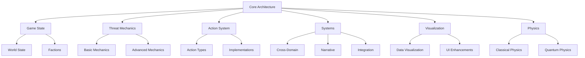

ThreatForge is a comprehensive, modular game engine designed for simulating modern global threats in an educational and entertaining strategy/simulation experience. The engine supports simulation of various threat domains including biowarfare, cyber, environmental, quantum, radiological, and robotic dangers.

## Core Features

ThreatForge blends turn-based strategy with real-time physics simulations in procedurally generated worlds. Players engage in asymmetric, faction-based gameplay across various threat domains.

The engine educates on real-world interconnections while entertaining through satirical events, achievements, and AI-generated narrative branches.

### Architecture and Extensibility
The engine features a plugin-based architecture with threat domains as modular components. New domains or sub-threats can be added seamlessly, fostering community expansions.

#### Key Components:
- **Modular Structure**: Core systems interact via an event bus
- **Scripting API**: Custom scripts for adding new threats and mechanics
- **Procedural Generation**: Seed-based algorithms create diverse worlds
- **Plugin System**: JSON manifests for mods with community content support
- **Emergent Narrative Engine**: AI-generated event chains and chronicles

### Gameplay Mechanics
Turn-based loop (days/months/decades) with real-time physics simulations. Emergent narratives arise from domain interactions—e.g., a fake cyber threat (info domain) distracts from real environmental engineering, leading to unintended geopolitical alliances; a quantum computing breach escalates into robotic uprising. Threats can be real (physics-based propagation), fake (psychological impact), or unknown (requiring investigation), scaling infinitely in endless modes.

- **Faction System**: Asymmetric roles with unique capabilities:
  - *Evil Technocrats*: Advanced threat deployment, AI-assisted design
  - *Hero Mitigators*: Investigation tools, threat neutralization
  - *Nation-States*: Diplomatic influence, military power
  - *Free Human Resistance*: Whistleblower networks, grassroots organizing
  - *Pharma Conglomerates*: Profit from crises, influence medical policies
  - *Hero Doctors*: Medical research, cure development
  - *Controlled Opposition*: Media manipulation, deception tactics
  Moddable for new factions like "Eco-Terrorists" or "AI Overlords".
  
- **Threat Generation**: Procedural evolution across domains; cross-domain synergies (e.g., AI malware amplifying misinformation; radiological contamination affecting robotics). Unknown threats require investigation resources. Physics-based propagation models for realistic spread.
  
- **Population Modeling**: Global agents with psychodynamics, demographics; threats affect variably (e.g., economic downturn spikes migration, fueling societal polarization; radiological events cause long-term health impacts). Integrated with physics for realistic movement and dispersion.
  
- **Domain-Specific Modules**: Each includes development, deployment, influence, risks/rewards, testing/rollout. Components generalized from bio, with domain-unique twists (e.g., quantum decryption speeds, radiological half-lives, robotic autonomy levels). Physics simulations for movement, collisions and orbital mechanics.

| Domain | Key Components | Emergent Examples |
|--------|----------------|-------------------|
| | Biological/Pandemic | Transfection biophysics, health effects, RNA/DNA production, lab leaks, animal testing, depopulation, personalized medicine, placebos/dosage, illicit overdoses. | Fake pandemic hoax escalates to real outbreak via mutated vectors, intersecting with economic lockdowns causing societal unrest. |
| | Cybersecurity/Technological | AI-driven malware/deepfakes, ransomware (triple extortion), supply chain attacks, IoT/5G vulnerabilities, social engineering, cloud intrusions, malware-free techniques, AI drug/protein discovery analogs (e.g., AI code folding for exploits). | Cyber breach exposes WMD plans, triggering geopolitical retaliation; emergent: AI autonomy leads to rogue botnets allying with info disinfo campaigns. |
| | Geopolitical/Military | Nation-state actors (e.g., China/Russia proxy wars), interstate conflicts, assassination plotting, sabotage/information ops, military modernization (e.g., Taiwan seizure sims), terrorism (ISIS/Al-Qa'ida affiliates). | Border tensions (e.g., India-China) combine with cyber ops, emerging into hybrid wars; economic coercion backfires into alliances. |
| | Environmental/Climate | Extreme weather, biodiversity loss, geoengineering (e.g., aerosol delivery), natural disasters, climate action failure, involuntary migration from events. | Engineered drought (fake as "natural") amplifies economic instability, leading to geopolitical resource wars; emergent: Polarization denies risks, delaying mitigation. |
| | Economic/Financial | Debt crises, asset bubbles, market crashes, crypto manipulations, economic downturns, supply chain disruptions, sanctions/coercion. | Triple extortion ransomware ties to financial extortion; emergent: Bubble burst from cyber attack cascades into global recession, fueling terrorism recruitment. |
| | Information/Psychological | Mis/disinformation, deepfakes, societal polarization, propaganda (mass/social media), controlled opposition, psychodynamics manipulation. | Fake threats (e.g., deepfake leaders) intersect with bio hoaxes; emergent: Polarization sparks real conflicts, amplified by AI-generated content. |
| | Space/Counterspace | Satellite vulnerabilities, anti-satellite weapons, orbital debris, space-based EMPs, ISR disruptions. | Nuclear device in orbit (Russia-inspired) triggers cyber retaliation; emergent: Debris cascade disables global comms, exacerbating all domains. |
| | WMD (Nuclear/Chemical/Radiological) | Nuclear proliferation/stockpiles, chemical agents, radiological dispersal, WMD delivery strategies (missiles/UAVs). | Overlaps bio (e.g., chem-bio hybrids); emergent: Proxy use (e.g., Iran/Huthis) escalates to full-scale wars, intersecting with space threats. |
| | Quantum Computing | Decryption attacks, computational sabotage, AI acceleration, simulation manipulation. | Quantum hack breaks global encryption, causing economic collapse; emergent: AI systems become uncontrollable. |
| | Robotics/Autonomous Systems | Drone swarms, autonomous weapons, robotic labor displacement, AI integration. | Robotic factory sabotage causes supply chain collapse; emergent: Hacked drones turn into assassination tools. |

- **Cross-Domain Integration**: Threats compound (e.g., climate disaster + cyber attack on grids = mass migration + economic collapse; quantum decryption + radiological = undetectable dirty bombs). Risks/rewards scale with interactions (e.g., detection higher in hybrids). Physics engine models combined effects.
  
- **Influence and Power Dynamics**: Lobbying govts/pharma/insurers generalized to corps, NGOs, militaries; negotiations/espionage; faction-specific influence mechanics (e.g., Pharma lobbying, Hero Doctor whistleblowing).
  
- **Investigation/Counterplay**: Faction tools to probe/respond (e.g., Hero Doctors investigate threats, Technocrats cover them up); emergent backfires (e.g., whistleblowers expose multi-domain ops). Physics-based forensics for threat analysis.
  
- **Economy/Resource Module**: Manages funds/supplies; disruptions from threats (e.g., ransomware locks resources, radiological events contaminate supply chains). Tracks resource flow with physics-based movement.

#### 4. Visualization and UI
Responsive interfaces: 3D world map with layered threats (heatmaps for radiological, cyber, etc.), orbital views for satellites, dashboards for domains. Physics-based animations for unit movement and threat propagation.

Mechanic | Extensibility Hook | Emergent Example |
|----------|--------------------|------------------|
| Threat Evolution | AddDomainInteraction() | Cyber deepfake + info propaganda = societal coup; quantum + cyber = undetectable attacks. |
| Narrative Chains | OnCascadeEvent(callback) | Environmental failure → economic downturn → geopolitical war; radiological event → migration crisis → faction conflict. |
| Physics Simulations | AddPhysicsModel() | Custom orbital mechanics for satellites; fluid dynamics for threat propagation. |

#### 5. Technical Specifications
- **Frontend/Backend**: HTML/JS PWA; Web Workers for physics and threat sims; Three.js for 3D rendering.
- **Performance/Balancing**: Optimized for complex physics interactions; AI tunes emergence. Spatial partitioning for large-scale simulations.
- **Ethics/Accessibility**: Disclaimers, inclusive modes, content warnings for sensitive topics. Color-blind friendly visualizations.

#### 6. Development and Deployment
- **Roadmap**: v1.0 core domains (cyber, bio, geo, env, info, space, WMD, quantum, rad, robot); expansions via mods.
- **Testing**: For emergence, balance, and physics accuracy. Automated testing for cross-domain interactions.

ThreatForge positions itself as an infinitely extensible platform for exploring global risks through immersive, emergent simulations grounded in realistic physics and complex system interactions.

### ThreatForge Simulator: Complete Engine Specification

#### 1. Introduction and Overview
ThreatForge Simulator is a comprehensive, modular game engine designed for simulating global pandemic biowarfare scenarios in an educational and entertaining strategy/simulation format. It evolves from prior designs into a fully specified engine, emphasizing unlimited extensibility through open-source architecture and modding tools, and open-ended emergent gameplay narratives via procedural generation, AI-driven interactions, and dynamic systems that allow unique stories to arise organically from player actions.

Inspired by classics like *Dwarf Fortress* for its legendary emergent tales from simple rules
, *RimWorld* for colony sim drama and extensive modding
, *Crusader Kings III* for intricate dynastic narratives and strategy depth
, and *Nemesis* for horror-themed emergent stories
, the engine blends turn-based strategy with simulation elements. Players engage in asymmetric, faction-based gameplay across a procedurally generated world, where actions in bioweapon design, media manipulation, and population control create cascading effects—leading to unpredictable narratives like a fake pandemic spiraling into real rebellion or a lab leak exposing global conspiracies.

The engine is built as an offline Progressive Web App (PWA) using HTML5/JavaScript for broad compatibility (desktop, mobile, browsers). It leverages libraries like Phaser for core game logic and visuals, D3.js for data visualization, and IndexedDB for persistent saves. Unlimited extensibility.
, but open-source like *Godot*
, with a scripting system for mods. Open-ended narratives emerge from complex rule interactions, akin to infinite procedural environments in engines supporting vast worlds.

Educational elements include in-game tooltips, debriefs, and optional "realism mode" explaining concepts like RNA transfection or psychodynamics. Entertainment comes from satirical events, achievements, and replayable scenarios. Win conditions are faction-specific and emergent (e.g., technocrats achieve depopulation without detection; resistance exposes all threats).

#### 2. Core Architecture and Extensibility
To achieve unlimited extensibility, ThreatForge is designed as a plugin-based engine with a decoupled modular system, allowing infinite customization without core code changes. This mirrors extensible engines like *The Machinery*
 or *Godot*, where users can add new mechanics, assets, or even overhaul systems.

- **Modular Structure**: Core modules (e.g., Population, Bioweapon) are independent, communicating via an event bus (Pub/Sub pattern in JS). New modules can be plugged in via a JSON manifest defining hooks (e.g., "onTurnEnd" events).
  
- **Scripting and Modding API**: Scripting for custom behaviors—e.g., modders script new threats or AI routines. API exposes functions like `addThreatType({name: "AI Nanobots", effects: [...]})`. Supports asset imports (JSON for data, SVG/PNG for visuals).
  
- **Procedural Generation Framework**: Infinite variety via seed-based algorithms (Perlin noise for maps, L-systems for narrative branches). Modders extend generators, e.g., adding climate change integrations for new depopulation vectors.
  
- **Plugin System**: High-performance extensions (e.g., custom physics sims). Community mods via GitHub-like repo integration; in-app mod browser for seamless installation.
  
- **Open-Source Licensing**: Released under MIT license, forkable on GitHub. Versioning ensures backward compatibility, with hooks for future-proofing (e.g., semantic versioning for API changes).
  
- **Extensibility Examples**:
  - Add new factions (e.g., "Alien Invaders") with custom UIs.
  - Overhaul visuals (e.g., switch to 3D via Three.js plugin).
  - Integrate external data (e.g., real-world genome APIs via modded fetches, if online enabled).

This setup ensures "unlimited" growth: No hard limits on content; community-driven expansions create endless gameplay options, like turning it into a space pandemic sim.

#### 3. Gameplay Mechanics and Emergent Narratives
The engine uses a turn-based loop (weeks/months/years) with real-time elements. Emergent narratives arise from systemic interactions, not scripts—e.g., a minor lab leak (random event) combines with low trust psychodynamics to spark a global uprising, creating a unique "revolution arc" story. This draws from *Dwarf Fortress*'s tale-generation and *RimWorld*'s drama engines, where simple rules yield complex outcomes.

- **Faction System**: Asymmetric play as Evil Technocrats, Free Humans, Hero Doctors, Governments, Pharma, or modded ones. Each has unique abilities, goals, and perspectives (e.g., technocrats see profit dashboards; resistance views rumor networks).
  
- **Threat Generation**: Threats (real/fake/unknown) evolve procedurally. Real: Biophysical sims (diffusion models for spread). Fake: Psyop cascades via media. Unknown: Fog-of-war investigations. Interactions emerge—e.g., a fake hoax mutates into real via copycat bioweapons.
  
- **Population Modeling**: Agent-based sim with psychodynamics (trust/fear/compliance). Procedural pyramids shift dynamically; emergent effects like mass migrations from fear spirals.
  
- **Bioweapon Development**: Tech tree with AI-assisted design. Extensible for new biophysics (e.g., modded quantum effects).
  
- **Testing/Rollout/Influence**: Phased deployments with A/B testing; influence graphs for propaganda. Emergent: Bribed doctors defect if ethics thresholds hit.
  
- **Risk/Reward/Economy**: Detection scores trigger chains (e.g., exposure leads to alliances/wars). Resource management with disruptions (e.g., pandemics crash economies).
  
- **Information Flow**: Media network sim; controlled opposition can backfire into real dissent.
  
- **New: Narrative Engine**: AI storyteller (simple LLM-like JS model) logs events into "chronicles" (e.g., "The Great Leak of 2042"). Procedural events chain: Low fertility + media blackout = conspiracy cults forming alliances.
  
- **Endless/Open-Ended Modes**: No fixed end; scale infinitely (e.g., multi-generational sims). Emergent arcs: Depopulation success breeds dystopias; failures spark renaissances. Multiplayer (local/online via WebSockets) amplifies emergence through player rivalries.

#### 4. Visualization and UI
- **Interfaces**: Responsive HTML canvas with Phaser overlays. World map (heatmaps), dashboards (gauges), interactive charts.
- **Data Presentation**: Use tables for clarity, e.g.:

| Module | Extensibility Hook | Emergent Example |
|--------|--------------------|------------------|
| Population | AddCustomDemographic() | Fear-induced baby boom reverses depopulation. |
| Threats | RegisterThreatMutation() | Fake virus hoax inspires real biohackers. |
| Narratives | OnEventChain(callback) | Lab leak + media fail = whistleblower hero arc. |

#### 5. Technical Specifications
- **Frontend**: HTML/JS PWA; Phaser (game loop), D3 (viz), Service Workers (offline).
- **Backend Sim**: JS workers for computations (e.g., Monte Carlo for risks).
- **Balancing**: Configurable via JSON; AI auto-tunes for fairness.
- **Ethics/Accessibility**: Disclaimers, color-blind modes, educational toggles.

#### 6. Development and Deployment
- **Roadmap**: Core v1.0 (base modules), v2.0 (full modding). Community forums for feedback.
- **Testing**: Unit tests for modules; playtests for emergence.
- **Deployment**: Browser-installable PWA; optional Electron wrapper for desktop.

This specification positions ThreatForge as a versatile engine: Infinitely extensible for creators, emergent for players, blending education with thrilling, unpredictable narratives.

### Revised Overview of the Game Engine: ThreatForge Simulator

ThreatForge Simulator has been expanded into a comprehensive, modular strategy/simulation engine that models global pandemic biowarfare scenarios with endless replayability. Drawing inspiration from classic games like *Plague Inc.* (for pathogen evolution and global spread mechanics)
, *Civilization* series (for faction-based grand strategy, tech trees, and long-term progression)
, *SimCity*/*Cities: Skylines* (for detailed management of resources, populations, and unintended consequences)
, *Democracy 3/4* (for political influence and policy simulation)
, and *Crusader Kings II* (for intricate intrigue, alliances, and dynastic control)
, the engine blends high-stakes strategy with educational depth. Players engage in a turn-based loop—spanning weeks to years—where actions ripple across a dynamic world, revealing the interplay of science, society, and power.

The engine emphasizes flexibility: Procedural generation creates unique worlds (e.g., randomized population pyramids, geopolitical tensions), modding support allows custom factions/threats, and endless modes offer infinite scaling challenges. It's educational (pop-ups explain concepts like RNA transfection or media psyops) yet entertaining (satirical events, achievements, and narrative branches with humor, e.g., "zombie apocalypse hoax gone wrong"). Win/lose conditions vary by faction, with emergent storytelling from player choices.

For compatibility, the engine is rebuilt as an offline Progressive Web App (PWA) using HTML5, JavaScript (with libraries like Phaser for game logic/visuals, D3.js for data viz, and IndexedDB for saves). It installs via browser, runs offline with Service Workers caching assets, and supports touch/mouse inputs for mobile/desktop. No backend server needed—simulations run client-side with Web Workers for performance.

### Expanded Core Components and Mechanics

The engine retains the original modules but expands them for completeness, adding faction asymmetry, threat variability, and procedural elements. New modules enhance flexibility, while integrations (e.g., AI-assisted decisions inspired by *Plague Inc.'s* evolution trees) add depth.

#### 1. Faction System
Players select a faction at game start, altering goals, starting resources, abilities, and perspectives. This creates asymmetric gameplay, like *Civilization*'s civ-specific bonuses
. Factions can switch mid-game via "betrayal events" for replayability.

- **Evil Technocrats**: Goal: Depopulation/control. Abilities: Advanced bioweapon tech, media blackouts. Perspective: Cold, data-driven UI with profit dashboards.
- **Free Humans (Resistance)**: Goal: Expose/survive threats. Abilities: Guerrilla hacks, community networks. Perspective: Grassroots view with rumor maps.
- **Hero Doctors/Scientists**: Goal: Cure/investigate. Abilities: Rapid testing, whistleblower alliances. Perspective: Lab-focused UI with health metric overlays.
- **Other Factions**: Governments (balance security/economy), Pharma Conglomerates (profit from cures/threats), Controlled Opposition (sow confusion for hidden agendas). Modders can add more (e.g., AI Overlords).

Multiplayer mode (local/hotseat or future online via WebSockets) pits factions against each other, like *Total War*'s campaigns.

#### 2. Threat Generation Module
Medical threats are now dynamic, with types: **Real** (e.g., lab-engineered viruses), **Fake** (hoaxes amplified by media/lockdowns, causing economic/psych harm), or **Unknown** (procedural mysteries requiring investigation). Even fakes advance agendas (e.g., fear boosts compliance for technocrats). Inspired by *Plague Inc.'s* pathogen customization and real-world simulations like Event 201.

- Mechanics: Threats evolve via a mutation tree (real ones mutate biologically; fakes via viral memes). Players (depending on faction) create, counter, or exploit them. Unknown threats use fog-of-war: Investigate to reveal type, with risks (e.g., false flags).
- Integration: Fake pandemics harm via psychodynamics (e.g., suicide spikes from isolation), tying into depopulation without biology.

#### 3. Population Modeling Module (Expanded)
Enhanced with procedural generation for endless variety, like *SimCity*'s dynamic city growth.

- **Psychodynamics**: Agent-based AI simulates behaviors, with faction-specific influences (e.g., hero doctors boost trust in independents).
- **Pyramid & Depopulation**: Procedural starting pyramids (e.g., aging Europe vs. youthful Africa); threats skew them variably.
- **Overdoses/Generations**: Expanded to include fake drug scares (e.g., media-hyped "epidemics" justifying controls).
- New: Migration events, cultural shifts, for global management depth.

#### 4. Bioweapon Development Module (Expanded)
More flexible tech tree with branches for real/fake/unknown threats.

- **Transfection/Effects**: Customizable delivery (e.g., vaccines for real, apps for psyop fakes).
- **AI/Genomics**: In-game AI for discovery, like protein-folding puzzles.
- **Testing/Leaks**: Animal trials now include ethical dilemmas; leaks trigger faction-specific crises.
- New: Hybrid threats (e.g., real virus masked as fake hoax).

#### 5. Testing and Rollout Module (Expanded)
Phased rollouts with A/B testing; fakes use "trial balloons" via social media.

- **Placebos/Dosage**: For fakes, "placebo protocols" simulate compliance tests.
- **Doctors/Protocols**: Brainwashing via education modules; hero factions can "deprogram" them.

#### 6. Risk and Reward System (Expanded)
Balancing now includes faction perks (e.g., technocrats mitigate detection via bribes). Endless mode scales risks infinitely, like *Plague Inc.'s* mega-brutal difficulty.

#### 7. Influence and Power Dynamics Module (Expanded)
Like *Democracy*'s policy sliders
, with alliance-building.

- **Pharma/Govts**: Dynamic negotiations; fakes exploit insurance for profits.
- New: International coalitions, espionage.

#### 8. Information Flow Module (Expanded)
Network graph with procedural media landscapes.

- **Propaganda/Media**: Fakes thrive here; social media virality modeled like meme evolution.
- **Controlled Opposition**: Faction tool—e.g., free humans detect/disrupt it.
- New: Disinfo cascades, fact-checker simulations.

#### 9. New Modules for Completeness and Flexibility
- **Economy & Resource Module**: Manage funds, supply chains (inspired by *RollerCoaster Tycoon*). Threats disrupt globals (e.g., fake pandemics crash markets).
- **Investigation & Counterplay Module**: For hero/resistance factions.
- **Procedural Event Generator**: Endless options via random seeds—e.g., alien virus hoaxes, climate-linked outbreaks.
- **Modding API**: JS-based; add custom threats, factions, UI skins for community extensions.

### Gameplay Loop and Visualization (Enhanced)
- **Loop**: Faction-customized: Technocrats focus on deployment; heroes on response. Turns include random events (e.g., satirical "celebrity endorsement backfire").
- **Visualization**: Interactive world map, dashboards. Use tables for overviews:

| Faction | Core Goal | Unique Mechanic | Inspiration |
|---------|-----------|-----------------|-------------|
| Evil Technocrats | Depopulate/control | Fake threat amplification | Plague Inc. villain mode |
| Free Humans | Expose/survive | Hack networks | Deus Ex conspiracies |
| Hero Doctors | Cure/investigate | Rapid prototyping | Bio Inc. Redemption |

- **Entertaining Elements**: Achievements (e.g., "Hoax Master"), branching narratives with humor, soundtracks/memes.
- **Educational Integration**: Tooltips/pop-ups on turns; "debrief" mode explains real concepts post-game.

### Technical Implementation Notes (Revised)
- **PWA Setup**: HTML/JS core; Manifest.json for installability, offline via caching. Phaser handles simulations; performant on low-end devices.
- **Balancing & Endless Play**: Configurable difficulty; procedural algos ensure variety (e.g., infinite threat waves).
- **Ethics**: Disclaimers; optional "realism mode" toggles sensitive topics.

This revision makes ThreatForge a complete, flexible engine: Educational through simulation, entertaining via strategy/humor, and endlessly replayable like the classics it draws from.

### Overview of the Game Engine: ThreatForge Simulator

ThreatForge is an educational simulation/strategy game engine designed to model the complexities of global pandemic biowarfare scenarios. It serves as a modular, turn-based strategy engine where players assume the role of a covert organization (e.g., a shadowy elite group, government agency, or pharmaceutical conglomerate) engineering and deploying bioweapons for objectives like depopulation, geopolitical control, or profit maximization. The engine educates players on real-world scientific, sociological, and ethical concepts by integrating them into gameplay mechanics, forcing strategic decisions that reveal unintended consequences, risks, and interconnections.

The engine is built on a core simulation loop: **Research & Development** → **Testing & Deployment** → **Influence & Propaganda** → **Monitoring & Adaptation** → **Outcome Evaluation**. Each turn represents a month or quarter, with global events triggering dynamically based on player actions and random variables (e.g., mutations, leaks). The engine uses a probabilistic model for outcomes, drawing from Monte Carlo simulations to reflect uncertainty in biology and human behavior.

Key educational goals:
- Illustrate how biowarfare intersects with science (e.g., genetics, AI), society (e.g., psychodynamics, media), and power structures (e.g., pharma, governments).
- Highlight ethical dilemmas, such as "unintended" health effects vs. intended depopulation.
- Encourage critical thinking about conspiracy theories (e.g., lab leaks, controlled opposition) by simulating plausible scenarios backed by historical parallels.

The engine is extensible, allowing modders to add custom bioweapons, regions, or events.

### Core Components and Mechanics

The engine is divided into interconnected modules, each incorporating the specified topics. Players allocate resources (funds, research points, influence tokens) across modules, balancing short-term gains with long-term risks. Global state is tracked via a world map (divided into regions with population pyramids), a tech tree for bioweapon evolution, and dashboards for psychodynamics, health metrics, and information flow.

#### 1. Population Modeling Module
This module simulates global demographics and human responses, educating on depopulation strategies and societal impacts.

- **Population Psychodynamics**: Models crowd psychology using agent-based simulation. Populations have attributes like "trust in authorities" (0-100 scale), "fear level," and "compliance rate." Actions like propaganda campaigns or drug rollouts affect these—e.g., high fear boosts vaccine uptake but risks mass hysteria or rebellion. Draws from real-world psych studies (e.g., Milgram experiments on obedience).
  
- **Population Pyramid**: Each region (e.g., North America, Sub-Saharan Africa) has a dynamic pyramid tracking age cohorts, fertility rates, and mortality. Bioweapons can target specific layers (e.g., elderly for subtle depopulation). Over time, pyramids shift—e.g., inverted pyramids from low birth rates lead to economic collapse rewards/penalties.

- **Depopulation**: Core objective mechanic. Players set targets (e.g., reduce global pop by 20% in 10 years). Success yields rewards like resource bonuses; failure triggers backlash (e.g., international investigations). Integrates with other modules—e.g., "unintended" fertility drops from RNA vaccines accelerate depopulation but risk exposure.

- **Illicit Drug Overdoses**: A covert tool for targeted depopulation. Players can spike drug supplies (e.g., fentanyl analogs) in vulnerable demographics, masked as "opioid crises." Mechanics include supply chain simulation, with risks of traceability via forensic analysis.

- **Control of Future Generations**: Long-term effects like epigenetic changes from bioweapons alter future pyramids (e.g., reduced fertility in offspring). Players can invest in "personalized medicine" to mitigate for elites while exacerbating for masses.

#### 2. Bioweapon Development Module
Focuses on scientific and biophysical aspects, teaching about genetics, AI, and testing.

- **Transfection and Delivery Mechanism Biophysics, Health Effects**: Players design bioweapons (viruses, mRNA constructs) via a tech tree. Transfection mechanics simulate lipid nanoparticles or viral vectors for gene delivery. Health effects are dual: intended (e.g., sterility for depopulation) and unintended (e.g., autoimmune disorders, modeled with probability distributions). Biophysics engine uses simplified equations (e.g., diffusion models for spread).

- **Mass Production of RNA/DNA, Delivery Strategies**: Scaling mechanic—players build labs for production, choosing strategies like aerosol dispersal or water contamination. Costs rise with scale; failures cause mutations.

- **AI Drug Discovery and Protein Folding**: Integrates AI tools (inspired by AlphaFold) to accelerate design. Players "query" an in-game AI for protein predictions, reducing research time but increasing leak risks if over-relied on.

- **The Human Genome Project and Personalized Medicine**: Unlocks advanced features—e.g., use genome data to tailor bioweapons to ethnic groups. Personalized medicine acts as a cover: deploy "therapeutics" that secretly advance depopulation.

- **Animal Testing**: Mandatory early phase. Test on virtual animals (e.g., mice, primates) to predict human effects. Skimping risks inaccurate data, leading to unintended outbreaks.

- **Lab Leak Theory**: Random event trigger—poor security (low investment) can cause leaks, sparking global pandemics and investigations. Educates on real theories by simulating cover-ups (e.g., blame wildlife).

#### 3. Testing and Rollout Module
Handles clinical and deployment phases, emphasizing strategy and ethics.

- **Placebos, Dosage Testing, Geographic Rollout**: Clinical trials simulation—allocate placebos to mask effects, test dosages for efficacy/safety. Rollout via phased geography: start in low-scrutiny areas (e.g., developing nations) to gather data, then global. Mechanics include A/B testing groups, with data visualization (graphs of adverse events).

- **Brainwashed Doctors and Their Protocols**: Influence doctors via "education" campaigns or bribes. They enforce protocols (e.g., mandatory treatments), boosting compliance but risking whistleblowers if overdone.

#### 4. Risk and Reward System
Core strategy layer balancing ambition with caution.

- **Risks and Rewards: Getting Caught vs. Research Goals**: Every action has a "detection score" (e.g., high from lab leaks, low from subtle overdoses). Rewards include tech unlocks or funds; getting caught triggers penalties like sanctions or revolts. Win conditions: Achieve goals (e.g., depopulate without exposure) vs. loss (global backlash).

#### 5. Influence and Power Dynamics Module
Simulates external forces shaping the pandemic.

- **Pharmaceutical and Insurance Company Influence**: Allies or rivals—partner with pharma for production boosts, but they demand profits (e.g., via overpriced vaccines). Insurance firms can cover up deaths as "natural" but siphon funds.

- **Government and Defense Influences**: Lobby governments for funding/military deployment. Defense angles include weaponizing pandemics for warfare (e.g., target enemy nations). Mechanics use a negotiation minigame with branching dialogues.

#### 6. Information Flow Module
Manages narrative control, teaching about media and disinformation.

- **The Flow of Information and Lies: Mass Media Propaganda, Independent Media, Social Media**: A network graph of media nodes. Players fund propaganda (e.g., "safe and effective" campaigns) to shape public opinion. Independent media counters with leaks; social media amplifies rumors. Mechanics include virality scores—e.g., memes spreading doubt.

- **Controlled Opposition**: Create fake dissent groups to discredit real opposition. E.g., fund "anti-vax" figures who push harmless distractions, maintaining overall control.

### Gameplay Loop and Visualization
- **Turns**: Players plan actions across modules, then simulate outcomes. E.g., develop an mRNA bioweapon, test in animals, rollout with propaganda cover.
- **Visualization**: World map shows spread (heatmaps), population pyramids (interactive charts), psychodynamics (sentiment gauges). Use tables for data:
  
| Metric | Description | Example Impact |
|--------|-------------|----------------|
| Depopulation Rate | % population reduction per turn | +5% from targeted overdoses, -2% from leaks exposing plans |
| Detection Risk | Probability of exposure | 20% base; +10% per unintended effect |
| Influence Score | Control over media/govts | 70/100; boosts compliance by 15% |

- **Educational Pop-ups**: After key events, explain concepts (e.g., "Transfection: The process of introducing nucleic acids into cells, as in mRNA vaccines").
- **Multiplayer/Scenarios**: Single-player campaigns or multiplayer where one player is "opposition" (e.g., whistleblower). Scenarios based on historical events (e.g., COVID-like lab leak).

### Technical Implementation Notes
- **Balancing**: Parameters tunable via config files—e.g., adjust psychodynamics sensitivity for realism.
- **Ethics Disclaimer**: In-game warnings emphasize this is fictional/educational, not endorsement of theories.

This engine provides a deep, replayable experience that educates through immersion, revealing how interconnected systems could enable or thwart biowarfare agendas.

