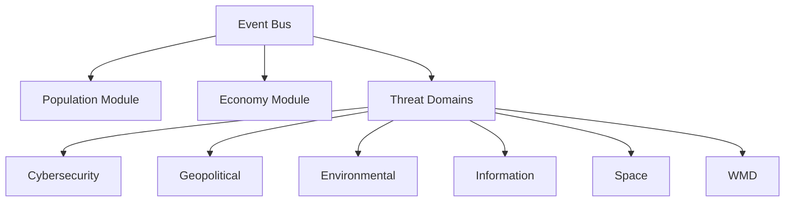

# Core Architecture

## Modular Structure

## Key Components
- **Event Bus**: Pub/Sub system for inter-module communication
- **Domain Plugins**: JSON manifests defining:
  - Threat types
  - Mechanics
  - Cross-domain hooks
- **Procedural Generators**: Seed-based algorithms for:
  - World creation
  - Threat evolution trees
  - Narrative branches
- **Scripting API**: Custom scripts for adding new threats and mechanics
- **Plugin System**: JSON manifests for mods with community content support
- **Emergent Narrative Engine**: AI-generated event chains and chronicles

## Extensibility
The engine features a plugin-based architecture with threat domains as modular components. New domains or sub-threats can be added seamlessly, fostering community expansions. Key extensibility features include:

- **Modular Structure**: Core modules are independent, communicating via an event bus (Pub/Sub pattern in JS). New modules can be plugged in via a JSON manifest defining hooks (e.g., "onTurnEnd" events)
- **Scripting and Modding API**: Exposes functions like `addThreatType({name: "AI Nanobots", effects: [...]})`. Supports asset imports (JSON for data, SVG/PNG for visuals)
- **Procedural Generation Framework**: Infinite variety via seed-based algorithms (Perlin noise for maps, L-systems for narrative branches)
- **Plugin System**: High-performance extensions (e.g., custom physics sims) with community mod support
- **Open-Source Licensing**: Released under MIT license, forkable on GitHub with semantic versioning for API changes

### Extensibility Examples:
- Add new factions (e.g., "Alien Invaders") with custom UIs
- Overhaul visuals (e.g., switch to 3D via Three.js plugin)
- Integrate external data (e.g., real-world genome APIs via modded fetches)