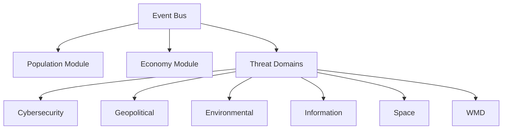
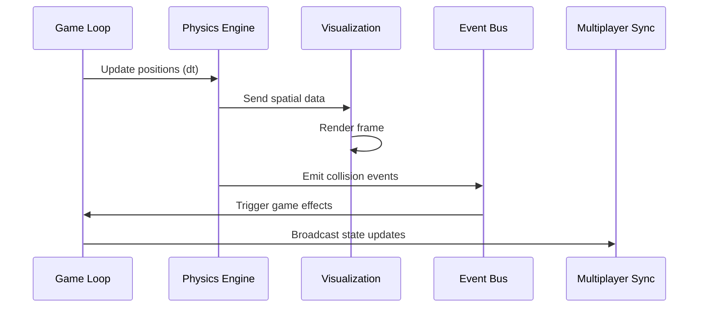

# Core Architecture

## Modular Structure

## Key Components
- **Event Bus**: Pub/Sub system for inter-module communication
- **Domain Plugins**: JSON manifests defining:
  - Threat types
  - Mechanics
  - Cross-domain hooks
- **Procedural Generators**: Seed-based algorithms for:
  - World creation
  - Threat evolution trees
  - Narrative branches
- **Scripting API**: Custom scripts for adding new threats and mechanics
- **Plugin System**: JSON manifests for mods with community content support
- **Emergent Narrative Engine**: AI-generated event chains and chronicles

## Extensibility
The engine features a plugin-based architecture with threat domains as modular components. New domains or sub-threats can be added seamlessly, fostering community expansions. Key extensibility features include:

- **Modular Structure**: Core modules are independent, communicating via an event bus (Pub/Sub pattern in JS). New modules can be plugged in via a JSON manifest defining hooks (e.g., "onTurnEnd" events)
- **Scripting and Modding API**: Exposes functions like `addThreatType({name: "AI Nanobots", effects: [...]})`. Supports asset imports (JSON for data, SVG/PNG for visuals)
- **Procedural Generation Framework**: Infinite variety via seed-based algorithms (Perlin noise for maps, L-systems for narrative branches)
- **Plugin System**: High-performance extensions (e.g., custom physics sims) with community mod support
- **Open-Source Licensing**: Released under MIT license, forkable on GitHub with semantic versioning for API changes

### Extensibility Examples:
- Add new factions (e.g., "Alien Invaders") with custom UIs
- Overhaul visuals (e.g., switch to 3D via Three.js plugin)
- Integrate external data (e.g., real-world genome APIs via modded fetches)

# Technical Specifications

## Implementation Details
- **Frontend/Backend**: HTML/JS PWA; Web Workers for physics and threat sims; Three.js for 3D rendering
- **Performance/Balancing**:
  - Optimized for complex physics interactions
  - AI tunes emergence
  - Spatial partitioning for large-scale simulations
  - LOD (Level of Detail) rendering with 4 quality levels
  - Spatial partitioning for entity management (quadtree for 2D, octree for 3D)
  - WebGPU acceleration for visualization rendering
  - Frame budget: 16ms (60 FPS target) with dynamic quality scaling
  - Dedicated physics threads for robotic swarm simulations
- **Ethics/Accessibility**:
  - Disclaimers
  - Inclusive modes
  - Content warnings for sensitive topics
  - Color-blind friendly visualizations
  - Educational mode with real-world parallels and historical references
  - Privacy-preserving analytics with opt-in consent
  - Quantum ethics guidelines for responsible simulation

## Development and Deployment
- **Roadmap**:
  - v1.0 core domains (cyber, bio, geo, env, info, space, WMD, quantum, rad, robot)
  - Expansions via mods
- **Testing**:
  - For emergence, balance, and physics accuracy
  - Automated testing for cross-domain interactions
  - Playtests for emergence
- **Deployment**:
  - Browser-installable PWA
  - Optional Electron wrapper for desktop

## Physics in Game Loop

## Spatial Event Examples
| Event Type | Condition | Effect |
|------------|-----------|--------|
| Satellite pass | Satellite over region | +Intel gathering |
| Unit collision | Military units in same cell | Combat initiated |
| Threat detection | Threat in sensor range | Visibility increased |
| Orbital strike | Weapon sat in position | Regional damage |
| Economic collapse | Region stability < 20% | Faction resource penalty |