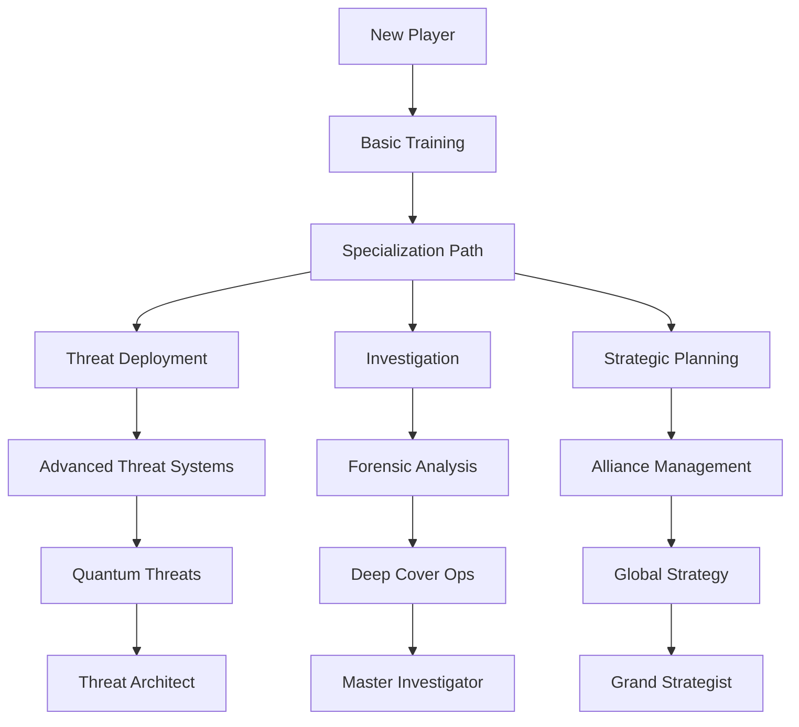

# Game Progression Systems

## Victory Conditions
- **Technocrat Victory**:
  - Achieve 75% global control
  - Maintain 90% economic dominance for 10 turns
  - Successfully deploy 5+ existential threats

- **Mitigator Victory**:
  - Reduce global threat level below 20%
  - Maintain 80%+ population stability for 15 turns
  - Expose 10+ conspiracies

- **Nation-State Victory**:
  - Control 50%+ of regions
  - Form 3+ strategic alliances
  - Maintain diplomatic immunity for 20 turns

- **Resistance Victory**:
  - Create 10+ whistleblower networks
  - Disrupt 5+ major operations
  - Achieve 70%+ population trust

## Player Progression

## Tutorial System
- **Interactive Tutorials**: Context-sensitive guidance based on player actions
- **Scenario-Based Learning**: Progressive challenges teaching core mechanics
- **Faction-Specific Training**: Unique tutorials for each faction type
- **Physics Sandbox**: Safe environment to experiment with unit movement and interactions
- **Narrative Examples**: Interactive walkthroughs of historical event chains