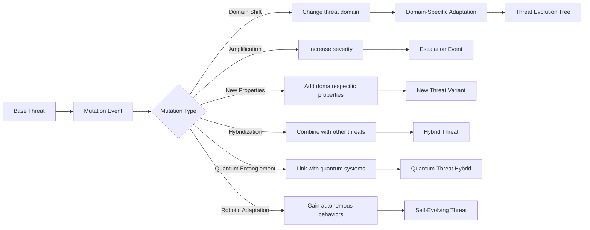

# Advanced Threat Mechanics

## Threat Mutation System

## Threat Containment
- **Containment Zones**: Specialized units to isolate threats
- **Quarantine Protocols**: Restrict population and unit movement
- **Vaccination Programs**: Reduce biological threat impact
- **Cyber Firewalls**: Block digital threat propagation
- **Radiation Shielding**: Mitigate radiological contamination
- **Quantum Isolation Fields**: Contain quantum threats
- **Robotic Kill Switches**: Disable autonomous threats

## Threat Synergy Effects
| Synergy Type | Effect | Example |
|--------------|--------|---------|
| Bio-Cyber | 2.0x data theft | Neural implants hacked through biological vectors |
| Quantum-Info | 3.0x disinformation | Quantum-generated deepfakes |
| Space-Env | 1.8x climate impact | Satellite weather manipulation |
| WMD-Bio | 2.5x casualties | Radiological dispersion of pathogens |
| Robot-Env | 1.7x ecological damage | Autonomous mining operations |
| Economic-Quantum | 3.0x market disruption | Quantum trading algorithms |
| Quantum-Robotic | 2.8x autonomy | Quantum AI controlling robotic swarms |
| Rad-Cyber | 2.3x disruption | EMP attacks disabling cyber defenses |