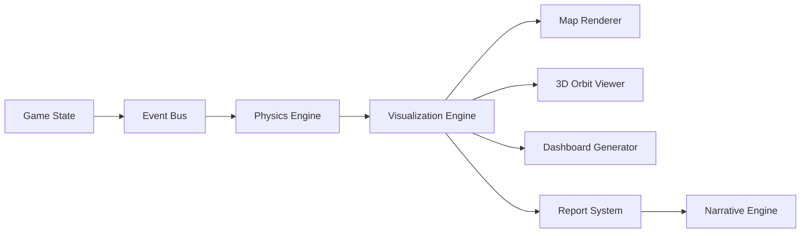

# Data Visualization System

## UI Components
1. **World Map View**:
   - Heatmap layers for threat concentrations
   - Faction control regions with dynamic borders
   - Resource flow vectors (animated)
   - Military unit positions and movement trails (with velocity vectors)
   - Satellite orbits and ground tracks (real-time orbital mechanics)
   - 3D terrain with elevation data and dynamic lighting
   - Threat propagation vectors (animated flow fields)

2. **Domain Dashboards**:
   - Threat evolution trees
   - Risk/reward matrices
   - Timeline projections

3. **Faction Consoles**:
   - Custom views per faction type
   - Technocrat: Threat deployment panels
   - Mitigator: Investigation tools
   - Nation-State: Diplomatic interfaces

## Data Flow


---

# Faction Spatial Capabilities

## Faction-Specific Units
```typescript
interface Faction {
  // ... existing properties ...
  
  // Spatial capabilities
  militaryUnits: MilitaryUnit[];
  satellites: Satellite[];
  sensorRange: number; // km
  movementSpeed: number; // multiplier
  deploymentConstraints: {
    maxUnits: number;     // Max units per region
    cooldown: number;     // Turns between deployments
    zoneRestrictions: string[]; // Allowed deployment zones
    // NEW: Deployment contexts
    deploymentContexts: ("SURFACE" | "UNDERGROUND" | "ORBITAL" | "AQUATIC")[];
    // NEW: Unit type restrictions
    unitTypeRestrictions?: MilitaryUnit['type'][];
  };
}
```

## Unit Deployment Costs
| Unit Type | Funds | Intel | Manpower | Tech | Domain |
|-----------|-------|-------|----------|------|--------|
| Infantry  | 100   | 10    | 50       | 5    | MIL    |
| Tank      | 500   | 30    | 20       | 20   | MIL    |
| Aircraft  | 1000  | 50    | 10       | 50   | MIL    |
| Naval     | 800   | 40    | 15       | 30   | MIL    |
| Comms Sat | 2000  | 100   | 5        | 100  | SPACE  |
| Weapon Sat| 5000  | 200   | 10       | 200  | SPACE  |
| Quantum Node | 8000 | 300   | 5        | 400  | QUANTUM|
| Rad Dispersal| 3000 | 150   | 8        | 100  | RAD    |
| Drone     | 1500  | 80    | 3        | 120  | ROBOT  |
| Autonomous Ground | 2500 | 120   | 5        | 180  | ROBOT  |
| Robotic Swarm | 3500 | 200   | 10       | 250  | ROBOT  |
| Bio Lab   | 4000  | 200   | 20       | 150  | BIO    | 
| Info Hub  | 1500  | 300   | 10       | 100  | INFO   | 
| Quantum Lab | 6000 | 400  | 15       | 300  | QUANTUM| 
| EMP Drone | 2000  | 150   | 5        | 200  | CYBER  | 