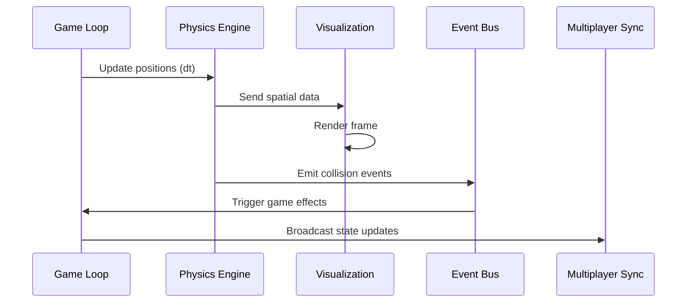

# Integration with Game Systems

## Physics in Game Loop

## Spatial Event Examples
| Event Type | Condition | Effect |
|------------|-----------|--------|
| Satellite pass | Satellite over region | +Intel gathering |
| Unit collision | Military units in same cell | Combat initiated |
| Threat detection | Threat in sensor range | Visibility increased |
| Orbital strike | Weapon sat in position | Regional damage |
| Economic collapse | Region stability < 20% | Faction resource penalty |