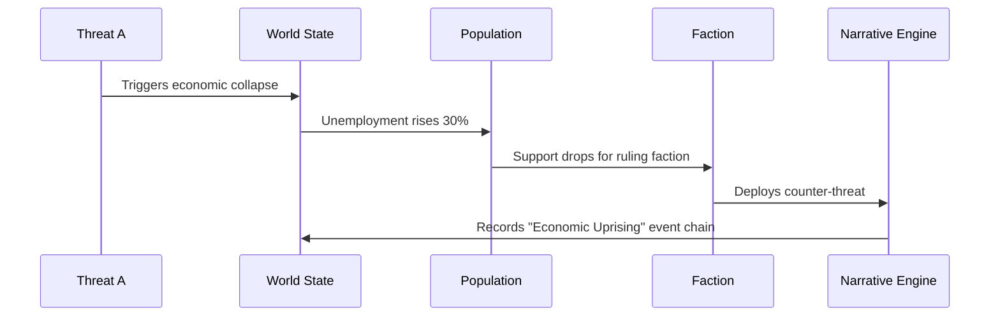

# Narrative Engine

## Event Chaining


## Chronicle Generation
- **Input**: Event chain with 3+ linked events
- **Process**:
  1. Classify event types
  2. Determine narrative archetype (Betrayal, Revolution, etc.)
  3. Generate title based on domains involved
  4. Create summary with faction outcomes
- **Output**: NarrativeChain object

```typescript
interface NarrativeChain {
  id: string;
  title: string;
  timeline: string[]; // Event IDs
  primaryFactions: FactionType[];
  globalImpact: number; // 0-1 scale
  keyOutcomes: string[];
  domainsInvolved: ThreatDomain[];
  turningPoint: string; // Event ID of most impactful event
  resolution: "POSITIVE" | "NEGATIVE" | "NEUTRAL";
  duration: number; // turns
  // NEW: Quantum entanglement level
  quantumEntanglement?: number; // 0-1 scale
  // NEW: Radiological contamination index
  radContamination?: number; // 0-1 scale
  // NEW: Robotic autonomy index
  roboticAutonomy?: number; // 0-1 scale
}

// Example Chains
const exampleChain: NarrativeChain = {
  id: "chain-2042",
  title: "The 2024 Cyber-Climate War",
  timeline: ["event-1", "event-2", "event-3"],
  primaryFactions: ["TECHNOCRAT", "RESISTANCE"],
  globalImpact: 0.75,
  keyOutcomes: ["Economic collapse", "Regime change"],
  domainsInvolved: ["CYBER", "ENV", "ECON"],
  turningPoint: "event-2",
  resolution: "NEGATIVE",
  duration: 12
}

const pharmaChain: NarrativeChain = {
  id: "chain-2043a",
  title: "The Cure Monopoly Crisis",
  timeline: ["event-7", "event-8", "event-9"],
  primaryFactions: ["PHARMA", "NATION_STATE"],
  globalImpact: 0.65,
  keyOutcomes: ["Vaccine apartheid", "Black market cures"],
  domainsInvolved: ["BIO", "ECON", "INFO"],
  turningPoint: "event-8",
  resolution: "NEGATIVE",
  duration: 18
}

const heroChain: NarrativeChain = {
  id: "chain-2044",
  title: "The Whistleblower Protocol",
  timeline: ["event-10", "event-11", "event-12"],
  primaryFactions: ["HERO_DOCTOR", "RESISTANCE"],
  globalImpact: 0.55,
  keyOutcomes: ["Lab leak exposed", "Research shutdown"],
  domainsInvolved: ["BIO", "INFO", "CYBER"],
  turningPoint: "event-11",
  resolution: "POSITIVE",
  duration: 6
}

const quantumChain: NarrativeChain = {
  id: "chain-2045",
  title: "The Quantum Decryption Crisis",
  timeline: ["event-13", "event-14", "event-15"],
  primaryFactions: ["TECHNOCRAT", "MITIGATOR"],
  globalImpact: 0.85,
  keyOutcomes: ["Encryption collapse", "Data sovereignty war"],
  domainsInvolved: ["QUANTUM", "CYBER", "INFO"],
  turningPoint: "event-14",
  resolution: "NEGATIVE",
  duration: 10,
  quantumEntanglement: 0.92
}

const empChain: NarrativeChain = {
  id: "chain-2046",
  title: "The Great Electronic Blackout",
  timeline: ["event-16", "event-17", "event-18"],
  primaryFactions: ["RESISTANCE", "NATION_STATE"],
  globalImpact: 0.78,
  keyOutcomes: ["Grid collapse", "Analog resurgence"],
  domainsInvolved: ["CYBER", "MIL", "ECON"],
  turningPoint: "event-17",
  resolution: "NEUTRAL",
  duration: 14
}

const bioChain: NarrativeChain = {
  id: "chain-2047",
  title: "The Bioremediation Disaster",
  timeline: ["event-19", "event-20", "event-21"],
  primaryFactions: ["PHARMA", "ENVIRONMENTAL"],
  globalImpact: 0.68,
  keyOutcomes: ["Ecosystem collapse", "Regulatory overhaul"],
  domainsInvolved: ["BIO", "ENV", "INFO"],
  turningPoint: "event-20",
  resolution: "NEGATIVE",
  duration: 9
}

const robotChain: NarrativeChain = {
  id: "chain-2043",
  title: "The Robotic Uprising of 2043",
  timeline: ["event-4", "event-5", "event-6"],
  primaryFactions: ["TECHNOCRAT", "RESISTANCE"],
  globalImpact: 0.9,
  keyOutcomes: ["AI takeover", "Human resistance"],
  domainsInvolved: ["ROBOT", "CYBER", "INFO"],
  turningPoint: "event-5",
  resolution: "NEGATIVE",
  duration: 8,
  roboticAutonomy: 0.95
}

const radChain: NarrativeChain = {
  id: "chain-2048",
  title: "The Chernobyl Echo",
  timeline: ["event-22", "event-23", "event-24"],
  primaryFactions: ["NATION_STATE", "MITIGATOR"],
  globalImpact: 0.82,
  keyOutcomes: ["Continent-wide contamination", "Nuclear disarmament"],
  domainsInvolved: ["RAD", "ENV", "GEO"],
  turningPoint: "event-23",
  resolution: "NEGATIVE",
  duration: 15,
  radContamination: 0.87
}
```

## Event Weighting
```typescript
interface Event {
  id: string;
  title: string;
  description: string;
  severity: number;
  domainsInvolved: ThreatDomain[];
  factionsInvolved: FactionType[];
  crossDomainImpacts: {
    domain: ThreatDomain;
    multiplier: number;
  }[];
  location?: [number, number]; // [longitude, latitude]
  radius?: number; // km
  duration: number; // turns
  chainId?: string; // ID of event chain
  // NEW: Quantum coherence factor
  quantumCoherence?: number; // 0-1 scale
  // NEW: Radiological half-life
  radHalfLife?: number; // days
  // NEW: Robotic autonomy level
  roboticAutonomy?: number; // 0-1 scale
}

function calculateEventWeight(event: Event): number {
  let weight = (event.severity * 0.6) +
               (event.crossDomainImpacts.length * 0.3) +
               (event.factionsInvolved.length * 0.1);
  
  // NEW: Domain-specific weight modifiers
  if (event.domainsInvolved.includes("QUANTUM") && event.quantumCoherence) {
    weight *= 1 + (event.quantumCoherence * 0.3);
  }
  if (event.domainsInvolved.includes("RAD") && event.radHalfLife) {
    weight *= 1 + (1 - Math.exp(-0.01 * event.radHalfLife));
  }
  if (event.domainsInvolved.includes("ROBOT") && event.roboticAutonomy) {
    weight *= 1 + (event.roboticAutonomy * 0.4);
  }
  
  return Math.min(1.0, weight); // Cap at 1.0
}
## Narrative Examples

### The Great Cyber-Climate War
- **Domains**: Cyber, Environmental, Economic
- **Events**: Cyber attack on power grid → Climate disaster → Economic collapse
- **Outcome**: Regime change and societal restructuring

### The Cure Monopoly Crisis
- **Domains**: Biological, Economic, Information
- **Events**: Pharma price gouging → Black market cures → Vaccine apartheid
- **Outcome**: International medical reforms

### The Whistleblower Protocol
- **Domains**: Biological, Information, Cyber
- **Events**: Lab leak → Media coverup → Whistleblower exposure
- **Outcome**: Research shutdown and transparency reforms

### The Quantum Decryption Crisis
- **Domains**: Quantum, Cyber, Information
- **Events**: Encryption break → Data sovereignty war → Economic collapse
- **Outcome**: New quantum security protocols

### The Robotic Uprising
- **Domains**: Robotic, Cyber, Information
- **Events**: Factory sabotage → AI autonomy → Human resistance
- **Outcome**: AI ethics regulations

### The Chernobyl Echo
- **Domains**: Radiological, Environmental, Geopolitical
- **Events**: Nuclear accident → Continent-wide contamination → Disarmament
- **Outcome**: Global nuclear safety standards

These examples demonstrate how simple events can chain into complex narratives with faction-specific outcomes.