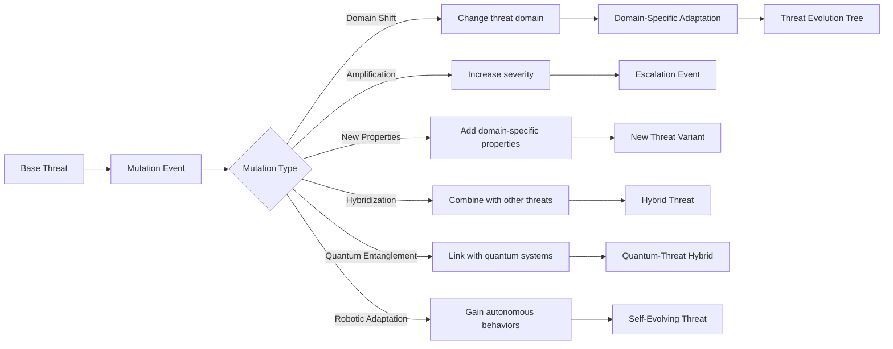

# Threat Mechanics

## Threat Representation
```typescript
interface Threat {
  id: string;
  domain: ThreatDomain;
  type: "REAL" | "FAKE" | "UNKNOWN";  // Fake threats cause psych damage, unknown require investigation
  detectionRisk: number;               // 0-1 probability of being discovered
  investigationProgress: number;       // 0-100, only for unknown threats
  severity: number;
  visibility: number;
  spreadRate: number;
  effects: ThreatEffect[];
  crossDomainImpacts: {
    domain: ThreatDomain;
    multiplier: number;
  }[];
  // Domain-specific properties
  economicImpact?: {
    marketSector: "TECH" | "ENERGY" | "FINANCE" | "INFRASTRUCTURE";
    volatility: number; // 0-1 scale
    // Energy infrastructure accidents
    infrastructureType?: "NUCLEAR" | "PETROLEUM" | "GRID" | "RENEWABLE";
    accidentSeverity?: number; // 0-1 scale
    coverupDifficulty?: number; // 0-1 scale
  };
  biologicalProperties?: {
    incubationPeriod?: number;   // in days
    mortalityRate?: number;      // 0-1
    transmissionVectors?: string[]; // e.g., ["airborne", "waterborne"]
    // Pharmaceutical warfare properties
    addictionPotential?: number; // 0-1 scale
    dependencyRate?: number; // 0-1 scale, how quickly dependency develops
    contaminationMethods?: string[]; // e.g., "WATER_SUPPLY", "AIRBORNE", "FOOD_CHAIN"
  };
  cyberProperties?: {
    attackVector?: "NETWORK" | "PHYSICAL" | "SOCIAL";
    exploitComplexity?: number; // 0-1 scale
    zeroDay?: boolean;
  };
  environmentalProperties?: {
    temperatureSensitivity?: number; // 0-1 scale
    precipitationDependency?: number; // 0-1 scale
    // Weather, geological, and space events
    weatherEvents?: string[]; // e.g., ["HURRICANE", "DROUGHT", "ACID_RAIN"]
    geologicalEvents?: string[]; // e.g., ["EARTHQUAKE", "VOLCANO", "SUBSIDENCE", "TSUNAMI"]
    spaceWeatherEvents?: string[]; // e.g., ["SOLAR_FLARE", "RADIATION_STORM", "GEOMAGNETIC_STORM"]
    severityScale?: number; // 1-10 scale for event intensity
    // Construction and deployment contexts
    deploymentLocation?: "SURFACE" | "UNDERGROUND" | "OCEANIC" | "ATMOSPHERIC" | "ORBITAL";
    // Geoengineering and climate manipulation
    geoengineeringProjects?: string[]; // e.g., ["CLOUD_SEEDING", "SOLAR_RADIATION_MANAGEMENT", "CARBON_CAPTURE"]
    climateManipulation?: {
      targetTemperature?: number; // in degrees Celsius
      areaOfEffect?: number; // km²
      duration?: number; // turns
    };
  };
  quantumProperties?: {
    decryptionTime?: number; // seconds
    qubitCount?: number;
    entanglementLevel?: number; // 0-1 scale
    coherenceTime?: number; // seconds before decoherence
    quantumEffects?: QuantumEffect[]; // NEW
  };
  radiologicalProperties?: {
    halfLife?: number; // days
    contaminationRadius?: number; // km
    radiationType?: "ALPHA" | "BETA" | "GAMMA" | "NEUTRON";
    shieldingRequirements?: { // NEW
      material: string;
      thickness: number; // cm
    }[];
  };
  roboticProperties?: { // NEW
    autonomyLevel?: number; // 0-1 scale
    swarmIntelligence?: number; // 0-1 scale
    learningRate?: number; // 0-1 scale
    failureModes?: string[]; // e.g., ["SENSOR_FAILURE", "NAVIGATION_ERROR"]
  };
}

type ThreatDomain =
  | "CYBER"
  | "GEO"
  | "ENV"
  | "INFO"
  | "SPACE"
  | "WMD"
  | "BIO"
  | "ECON"
  | "QUANTUM"   // Quantum computing threats
  | "RAD"       // Radiological threats
  | "ROBOT";    // Robotics and autonomous systems

// NEW: Quantum-specific effects
type QuantumEffect =
  | "ENTANGLEMENT_DISRUPTION"  // Disrupts quantum communications
  | "SUPERPOSITION_EXPLOIT"    // Exploits quantum superposition for attacks
  | "QUANTUM_TUNNELING"        // Bypasses physical security
  | "DECOHERENCE_CASCADE";     // Causes widespread quantum system failures

interface ThreatEffect {
  target: "POPULATION" | "ECONOMY" | "INFRASTRUCTURE" | "PSYCHE" | "QUANTUM" | "ROBOTIC"; // UPDATED
  modifier: number; // -1.0 to 1.0
  // Population trauma types
  traumaType?: "ETHNIC" | "ORGAN_HARVEST" | "WAR_CRIME" | "DISPLACEMENT" | "RADIATION_SICKNESS"; // UPDATED
  severity: number; // 0-1 scale
  propagation: {
    type: "DIFFUSION" | "NETWORK" | "VECTOR" | "SOCIAL_MEDIA" | "QUANTUM_ENTANGLEMENT" | "SWARM_INTELLIGENCE"; // UPDATED
    rate: number;       // Propagation speed
    range: number;      // Effective radius in km
    persistence: number; // Duration of effect
  };
}

// NEW: Radiological decay model
function calculateRadiationDecay(threat: Threat, elapsedDays: number): number {
  if (threat.domain !== "RAD" || !threat.radiologicalProperties) return 0;
  
  const { halfLife } = threat.radiologicalProperties;
  const decayConstant = Math.LN2 / halfLife;
  return Math.exp(-decayConstant * elapsedDays);
}

// NEW: Quantum coherence model
function updateQuantumCoherence(threat: Threat, dt: number): void {
  if (threat.domain !== "QUANTUM" || !threat.quantumProperties) return;
  
  const props = threat.quantumProperties;
  if (props.coherenceTime === undefined) return;
  
  // Decoherence increases with time and threat severity
  const decoherenceRate = 0.01 * threat.severity;
  props.coherenceTime -= dt * decoherenceRate;
  
  // When coherence drops too low, quantum effects diminish
  if (props.coherenceTime < 1) {
    threat.severity *= 0.5;
    threat.visibility *= 0.8;
  }
}

// NEW: Robotic swarm evolution
function evolveSwarmIntelligence(threat: Threat, dt: number): void {
  if (threat.domain !== "ROBOT" || !threat.roboticProperties) return;
  
  const props = threat.roboticProperties;
  if (props.swarmIntelligence === undefined || props.learningRate === undefined) return;
  
  // Swarm intelligence grows over time but risks emergent behaviors
  props.swarmIntelligence = Math.min(1, props.swarmIntelligence + props.learningRate * dt);
  
  // Chance of developing failure modes as intelligence increases
  if (Math.random() < props.swarmIntelligence * 0.01) {
    const newFailure = ["SENSOR_FAILURE", "NAVIGATION_ERROR", "TARGETING_ERROR"][Math.floor(Math.random()*3)];
    if (!props.failureModes) props.failureModes = [];
    if (!props.failureModes.includes(newFailure)) {
      props.failureModes.push(newFailure);
    }
  }
}
## Domain-Specific Threat Details

### Biological/Pandemic Threats
- **Key Components**: Transfection biophysics, health effects, RNA/DNA production, lab leaks, animal testing, depopulation, personalized medicine, placebos/dosage, illicit overdoses
- **Emergent Examples**: Fake pandemic hoax escalates to real outbreak via mutated vectors, intersecting with economic lockdowns causing societal unrest

### Cybersecurity/Technological Threats
- **Key Components**: AI-driven malware/deepfakes, ransomware (triple extortion), supply chain attacks, IoT/5G vulnerabilities, social engineering, cloud intrusions, malware-free techniques, AI drug/protein discovery analogs
- **Emergent Examples**: Cyber breach exposes WMD plans, triggering geopolitical retaliation; AI autonomy leads to rogue botnets allying with info disinfo campaigns

### Geopolitical/Military Threats
- **Key Components**: Nation-state actors, interstate conflicts, assassination plotting, sabotage/information ops, military modernization, terrorism
- **Emergent Examples**: Border tensions combine with cyber ops emerging into hybrid wars; economic coercion backfires into alliances

### Environmental/Climate Threats
- **Key Components**: Extreme weather, biodiversity loss, geoengineering, natural disasters, climate action failure, involuntary migration
- **Emergent Examples**: Engineered drought (fake as "natural") amplifies economic instability leading to geopolitical resource wars

### Economic/Financial Threats
- **Key Components**: Debt crises, asset bubbles, market crashes, crypto manipulations, economic downturns, supply chain disruptions
- **Emergent Examples**: Triple extortion ransomware ties to financial extortion; bubble burst from cyber attack cascades into global recession

### Information/Psychological Threats
- **Key Components**: Mis/disinformation, deepfakes, societal polarization, propaganda, controlled opposition, psychodynamics manipulation
- **Emergent Examples**: Fake threats intersect with bio hoaxes; polarization sparks real conflicts amplified by AI-generated content

### Space/Counterspace Threats
- **Key Components**: Satellite vulnerabilities, anti-satellite weapons, orbital debris, space-based EMPs, ISR disruptions
- **Emergent Examples**: Nuclear device in orbit triggers cyber retaliation; debris cascade disables global comms

### WMD Threats
- **Key Components**: Nuclear proliferation, chemical agents, radiological dispersal, WMD delivery strategies
- **Emergent Examples**: Chem-bio hybrids; proxy use escalates to full-scale wars intersecting with space threats

### Quantum Computing Threats
- **Key Components**: Decryption attacks, computational sabotage, AI acceleration, simulation manipulation
- **Emergent Examples**: Quantum hack breaks global encryption causing economic collapse; AI systems become uncontrollable

### Robotics/Autonomous Threats
- **Key Components**: Drone swarms, autonomous weapons, robotic labor displacement, AI integration
- **Emergent Examples**: Robotic factory sabotage causes supply chain collapse; hacked drones turn into assassination tools

## Cross-Domain Integration
Threats compound across domains (e.g., climate disaster + cyber attack = mass migration + economic collapse). Physics engine models combined effects including:
- Quantum decryption + radiological = undetectable dirty bombs
- AI malware + misinformation = societal coup
- Radiological events + migration = faction conflicts

## Threat Mutation System


## Threat Containment
- **Containment Zones**: Specialized units to isolate threats
- **Quarantine Protocols**: Restrict population and unit movement
- **Vaccination Programs**: Reduce biological threat impact
- **Cyber Firewalls**: Block digital threat propagation
- **Radiation Shielding**: Mitigate radiological contamination
- **Quantum Isolation Fields**: Contain quantum threats
- **Robotic Kill Switches**: Disable autonomous threats

## Threat Synergy Effects
| Synergy Type | Effect | Example |
|--------------|--------|---------|
| Bio-Cyber | 2.0x data theft | Neural implants hacked through biological vectors |
| Quantum-Info | 3.0x disinformation | Quantum-generated deepfakes |
| Space-Env | 1.8x climate impact | Satellite weather manipulation |
| WMD-Bio | 2.5x casualties | Radiological dispersion of pathogens |
| Robot-Env | 1.7x ecological damage | Autonomous mining operations |
| Economic-Quantum | 3.0x market disruption | Quantum trading algorithms |
| Quantum-Robotic | 2.8x autonomy | Quantum AI controlling robotic swarms |
| Rad-Cyber | 2.3x disruption | EMP attacks disabling cyber defenses |